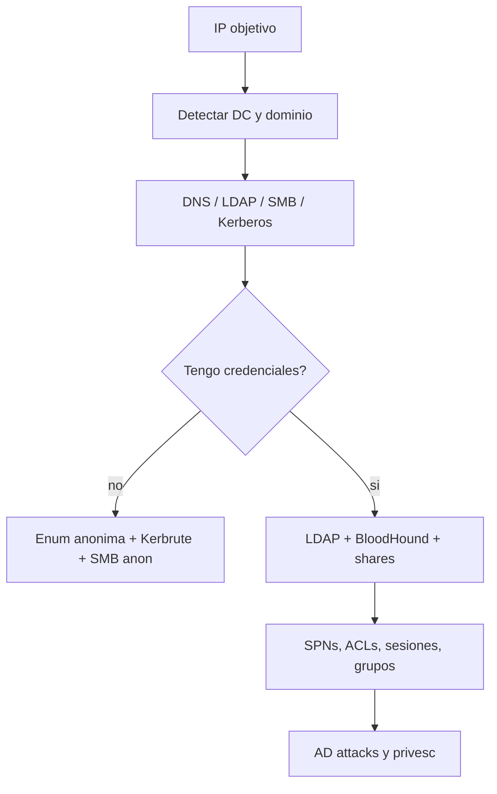

# HTB Windows AD Enumeration Cheatsheet

> [!abstract] TL;DR
> En AD, el objetivo es construir el mapa: **dominio, DCs, usuarios, grupos, equipos, shares, SPNs, delegaciones, ACLs y sesiones**. Con una cuenta low-priv, LDAP y SMB suelen revelar muchísimo.

## Mapa mental



## Puertos clave de AD

```text
53/tcp,udp    DNS
88/tcp,udp    Kerberos
135/tcp       MSRPC
139/tcp       NetBIOS
389/tcp,udp   LDAP
445/tcp       SMB
464/tcp,udp   Kerberos password change
593/tcp       RPC over HTTP
636/tcp       LDAPS
3268/tcp      Global Catalog
3269/tcp      Global Catalog SSL
3389/tcp      RDP
5985/tcp      WinRM
5986/tcp      WinRM HTTPS
```

## Setup rápido

```bash
export IP=10.10.10.10
export DOMAIN=example.htb
export DC=dc01.example.htb
mkdir -p scans loot bloodhound
```

```bash
echo "$IP $DC $DOMAIN" | sudo tee -a /etc/hosts
```

## Detectar dominio y DC

```bash
nmap -sV -sC -p53,88,135,139,389,445,464,593,636,3268,3269,3389,5985 $IP -oN scans/ad-detail.txt
```

```bash
# SMB suele filtrar hostname/domain
nmap --script smb-os-discovery -p445 $IP
crackmapexec smb $IP
```

```bash
# DNS SRV records
dig @$IP _ldap._tcp.dc._msdcs.$DOMAIN SRV
dig @$IP _kerberos._tcp.$DOMAIN SRV
```

> [!tip]
> Si Kerberos falla raro, revisá hora y DNS. AD depende muchísimo de ambos.

## Enumeración sin credenciales

### SMB anónimo

```bash
smbclient -L //$IP -N
smbmap -H $IP
enum4linux-ng -A $IP
```

### LDAP anónimo

```bash
ldapsearch -x -H ldap://$IP -s base namingcontexts
ldapsearch -x -H ldap://$IP -b "DC=example,DC=htb"
```

### Usuarios con Kerbrute

```bash
kerbrute userenum -d $DOMAIN --dc $IP /usr/share/seclists/Usernames/xato-net-10-million-usernames.txt
```

## Enumeración con credenciales

```bash
export USER='user'
export PASS='pass'
```

### Validar credenciales

```bash
crackmapexec smb $IP -u "$USER" -p "$PASS"
crackmapexec winrm $IP -u "$USER" -p "$PASS"
```

### SMB shares

```bash
crackmapexec smb $IP -u "$USER" -p "$PASS" --shares
smbmap -H $IP -u "$USER" -p "$PASS"
smbclient -L //$IP -U "$USER%$PASS"
```

### LDAP desde Linux

```bash
ldapsearch -x -H ldap://$IP -D "$USER@$DOMAIN" -w "$PASS" -b "DC=example,DC=htb" "(objectClass=user)" sAMAccountName
ldapsearch -x -H ldap://$IP -D "$USER@$DOMAIN" -w "$PASS" -b "DC=example,DC=htb" "(objectClass=group)" cn
ldapsearch -x -H ldap://$IP -D "$USER@$DOMAIN" -w "$PASS" -b "DC=example,DC=htb" "(servicePrincipalName=*)" servicePrincipalName sAMAccountName
```

### BloodHound

```bash
bloodhound-python -u "$USER" -p "$PASS" -d "$DOMAIN" -ns $IP -c All --zip
```

En Windows:

```powershell
.\SharpHound.exe -c All
```

Buscar en BloodHound:

- rutas a `Domain Admins`;
- `GenericAll`, `GenericWrite`, `WriteDacl`, `WriteOwner`;
- `ForceChangePassword`;
- sesiones de admins;
- computers con usuarios privilegiados logueados;
- delegation;
- grupos anidados.

## Enumeración desde una shell Windows

```cmd
whoami /user
whoami /groups
whoami /priv
set USERDOMAIN
set LOGONSERVER
net config workstation
```

```cmd
net user /domain
net group /domain
net group "Domain Admins" /domain
net group "Enterprise Admins" /domain
net group "Domain Controllers" /domain
net accounts /domain
```

PowerShell sin módulos externos:

```powershell
[System.DirectoryServices.ActiveDirectory.Domain]::GetCurrentDomain()
[System.DirectoryServices.ActiveDirectory.Forest]::GetCurrentForest()
```

Con RSAT:

```powershell
Get-ADDomain
Get-ADUser -Filter * -Properties ServicePrincipalName
Get-ADGroup -Filter *
Get-ADComputer -Filter *
```

## DNS y zone transfer

```bash
dig @$IP $DOMAIN
dig @$IP axfr $DOMAIN
dnsrecon -d $DOMAIN -n $IP
```

Ver [[Windows - DNS enum y zone transfer]].

## Shares y SYSVOL

```bash
smbclient //$IP/SYSVOL -U "$USER%$PASS"
smbclient //$IP/NETLOGON -U "$USER%$PASS"
```

Buscar:

- scripts de login;
- `.bat`, `.ps1`, `.vbs`;
- XML de Group Policy Preferences;
- credenciales hardcodeadas;
- rutas UNC internas.

## Kerberos quick checks

```bash
# AS-REP roast candidates
impacket-GetNPUsers $DOMAIN/ -usersfile users.txt -dc-ip $IP -no-pass

# Kerberoast candidates con credenciales
impacket-GetUserSPNs $DOMAIN/$USER:$PASS -dc-ip $IP -request
```

La explotación está en [[attacks-and-privesc|Windows AD Attacks and Privesc]].

## Checklist

```text
1. Cuál es el dominio y cuál es el DC?
2. DNS resuelve bien el dominio y los SRV records?
3. Hay SMB anónimo o LDAP anónimo?
4. Tengo lista de usuarios válida?
5. Las credenciales funcionan por SMB, LDAP, WinRM o MSSQL?
6. Hay shares con lectura/escritura?
7. Hay SPNs kerberoasteables?
8. Hay usuarios sin preauth Kerberos?
9. BloodHound muestra ruta a privilegios?
10. Hay sesiones de admins o delegaciones interesantes?
```

## Referencias

- [[attacks-and-privesc|Windows AD Attacks and Privesc]]
- [[ldap-y-active-directory]]
- [[kerberos-basico]]
- [[smb-cifs-y-shares-windows]]
- [[Windows - DNS enum y zone transfer]]
- BloodHound
- Impacket
- Kerbrute
