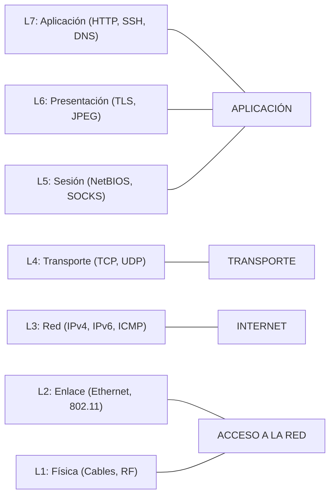

# Modelo OSI vs TCP/IP

> [!abstract] TL;DR
> - **OSI** es un marco teórico de 7 capas, ideal para troubleshooting estructurado y documentación.
> - **TCP/IP** es el modelo pragmático de 4 capas sobre el cual está construido el internet real.
> - En Red Team, saber en qué capa operas dicta qué herramientas usa el Blue Team para detectarte (ej. un NIDS inspecciona L3/L4, un WAF inspecciona L7).
> - Capas OSI clave: Física (L1), Enlace (L2 - MAC), Red (L3 - IP), Transporte (L4 - TCP/UDP), Aplicación (L7 - HTTP/DNS).

## Concepto

El stack de red no es un bloque monolítico; es una pila de abstracciones. Cada protocolo delega la complejidad al protocolo de la capa inferior y superior. 

- El **Modelo OSI** (Open Systems Interconnection) fue creado por la ISO en 1984 como un estándar normativo universal. En la práctica, es demasiado verboso en las capas superiores.
- El **Modelo TCP/IP** fue desarrollado por el DoD (DoD model) en los 70s y ganó la guerra porque era pragmático. Es el que literalmente da forma a internet.

En seguridad, pensamos en términos de **capas OSI**, no TCP/IP. Cuando decimos "Ataque L7", "Switch L2", o "Firewall L4", estamos hablando de OSI.

## Cómo funciona

Cada capa añade su propia cabecera (Header) al payload a medida que los datos "bajan" por el stack (Encapsulación), y se remueven cuando los datos "suben" (Desencapsulación).



### Encapsulación (Un paquete HTTP)
1. **L7 (Data):** `GET / HTTP/1.1`
2. **L4 (Segmento):** `[TCP Header (SrcPort: 34567, DstPort: 80)] + Data`
3. **L3 (Paquete):** `[IP Header (SrcIP: 192.168.1.10, DstIP: 203.0.113.5)] + Segmento`
4. **L2 (Trama/Frame):** `[Ethernet Header (SrcMAC, DstMAC)] + Paquete + [FCS]`

## Comandos / configuración

Para inspeccionar qué ocurre en cada capa dentro de Linux, usamos utilidades específicas. 

> [!warning]
> Evitá usar las *net-tools* antiguas (`ifconfig`, `netstat`, `arp`). Están deprecadas desde hace años. Acostumbrate a la suite `iproute2` y `ss`.

```bash
# ========================================
# L1 - Capa Física (Ver estado del enlace, velocidad)
# ========================================
ethtool eth0    # Muestra auto-negociación, Link detected: yes/no, duplex

# ========================================
# L2 - Capa de Enlace (Ver MACs, tablas ARP/NDP)
# ========================================
ip link show    # Muestra interfaces y sus direcciones MAC
ip neigh show   # Tabla ARP moderna (vecinos IPv4/IPv6)

# ========================================
# L3 - Capa de Red (IPs, Routing)
# ========================================
ip addr show    # IPs asignadas a las interfaces
ip route show   # Tabla de ruteo L3 (quién es el gateway por defecto)

# ========================================
# L4 - Capa de Transporte (Puertos abiertos, conexiones)
# ========================================
ss -tulpn       # Reemplazo de netstat. 
                # -t (tcp), -u (udp), -l (listening), -p (procesos), -n (numeric)

# ========================================
# L7 - Capa de Aplicación (Interacción pura)
# ========================================
curl -I https://example.com  # Petición HTTP pura
dig example.com A            # Resolución DNS pura
```

## Troubleshooting

La regla de oro del networking es hacer troubleshooting **de abajo hacia arriba** (Bottom-Up) o **de arriba hacia abajo** (Top-Down). Si falla el ping al gateway (L3), de nada sirve revisar el firewall (L4) o Nginx (L7).

| Síntoma | Falla probable | Comando de diagnóstico |
|---------|----------------|------------------------|
| Cable desconectado, NIC apagada | **L1 / L2** | `ip link show` (buscar estado UP/DOWN) |
| "Destination Host Unreachable" | **L2** (Falla ARP) | `ip neigh` (ver si la MAC está INCOMPLETE) |
| "No route to host" | **L3** (No hay ruta) | `ip route` o `ping <IP_gateway>` |
| "Connection refused" / "Timeout" | **L4** (Puerto cerrado / Firewall) | `nmap -p 80 <IP>`, `nc -zv <IP> 80` |
| "404 Not Found" / Error de cert | **L7** (Servicio corriendo pero falla) | `curl -vk https://<IP>` |

## Seguridad / ofensiva

Desde la perspectiva de Red Team / DevSecOps, el modelo OSI dicta la superficie de ataque y los controles defensivos.

- **Ataques L2 (Enlace):** Ocurren *dentro de la misma subnet* (broadcast domain).
  - ARP Spoofing/Poisoning (Hombre en el medio local).
  - MAC Flooding (Saturar el switch para que actúe como hub y sniffear tráfico).
  - *Defensa:* Dynamic ARP Inspection (DAI), Port Security.

- **Ataques L3 (Red):** Exceden la subnet.
  - IP Spoofing (Falsificar origen, útil en ataques UDP sin handshake, como amplificación DNS/NTP).
  - ICMP Smurf attacks, TTL Expiration attacks.
  - *Defensa:* uRPF, ACLs en routers perimetrales, IPSec.

- **Ataques L4 (Transporte):**
  - SYN Floods (Agotar la tabla de estados TCP).
  - Port Scanning (`nmap -sS`, `nmap -sU`).
  - *Defensa:* Firewalls Stateful (iptables/nftables), SYN Cookies, Rate Limiting.

- **Ataques L7 (Aplicación):**
  - SQLi, XSS, HTTP Request Smuggling, Tunneling sobre DNS/HTTP (exfiltración).
  - Slowloris (Agotar workers del servidor web mandando requests lentísimos).
  - *Defensa:* WAF (Web Application Firewall), Proxies Reversos, IDS L7 (Zeek/Suricata).

> [!tip] OPSEC C2 (Command & Control)
> Para que un beacon pase desapercibido, debes ofuscarlo en L7. Si estableces una reverse shell cruda (`nc -e /bin/sh`), viaja en L4 (TCP) pero no matchea el estándar de L7 esperado (ej. HTTP). Un EDR o NGFW detectará que por el puerto 80 fluye shell cruda y no HTTP legítimo, y te bloqueará al instante.

## Relacionado
- [[ethernet-y-arp]] (Profundización L2)
- [[ip-subnetting-cidr]] (Profundización L3)
- [[tcp-estados-y-handshake]] (Profundización L4)

## Referencias
- RFC 1122 - *Requirements for Internet Hosts - Communication Layers*
- RFC 791 - *Internet Protocol*
- ISO/IEC 7498-1:1994 - *The Basic Reference Model for Open Systems Interconnection*
- Man pages: `man ip`, `man ss`.
