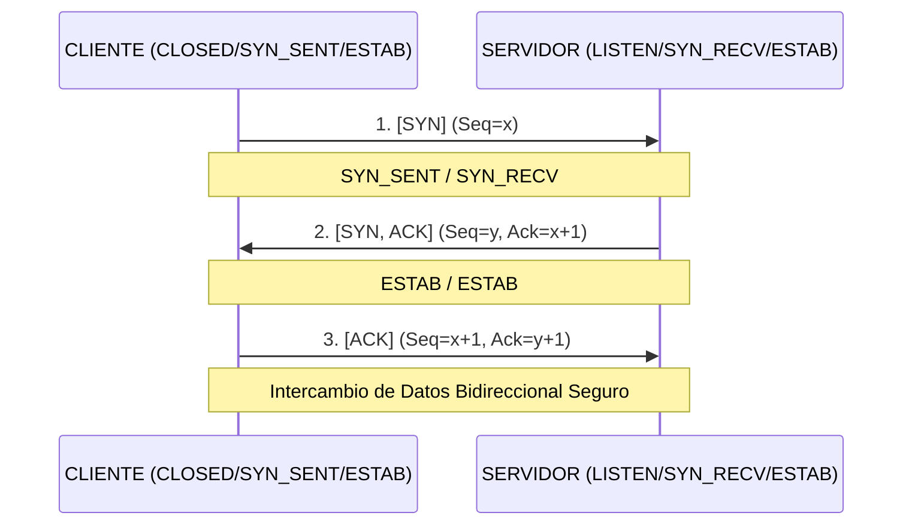
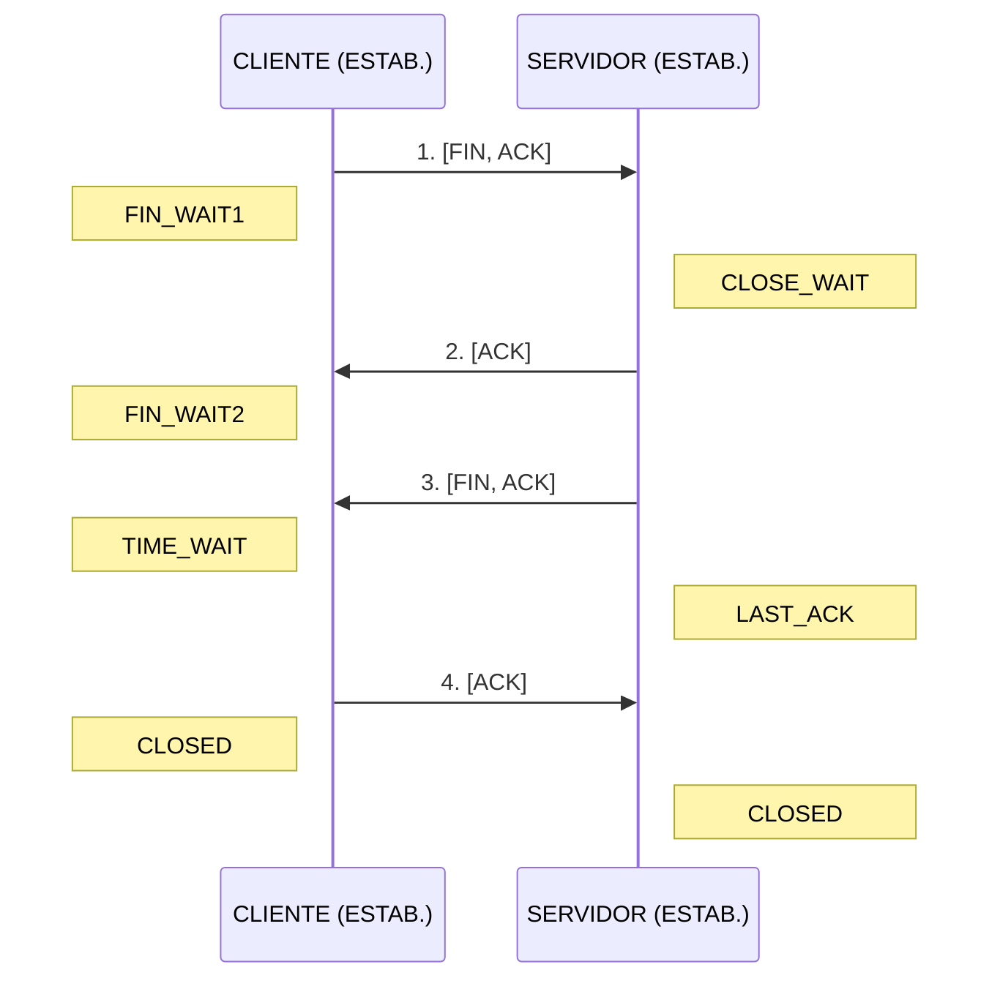

# TCP: Estados y Handshake

> [!abstract] TL;DR
> - **TCP (L4)** es un protocolo orientado a conexión, confiable y ordenado. Garantiza que los datos lleguen íntegros y en la secuencia correcta.
> - El **3-Way Handshake** (SYN, SYN-ACK, ACK) es el "hola, me escuchás?" antes de mandar datos.
> - El cierre de conexión (Teardown) usa 4 pasos (FIN, ACK, FIN, ACK).
> - Comprender los **flags TCP** y la **máquina de estados** es vital para escaneos de puertos (Nmap Stealth Scans) y evasión de Firewalls Stateful.

## Concepto

A diferencia de UDP (que es como tirar volantes desde una ventana esperando que alguien los agarre), TCP es una llamada telefónica formal. 

Imaginate:
1.  **Llamador (Cliente):** *"Hola, soy Juan, ¿me escuchás?"* (**SYN**).
2.  **Receptor (Servidor):** *"Sí Juan, te escucho. Soy Pedro, ¿vos me escuchás?"* (**SYN-ACK**).
3.  **Llamador (Cliente):** *"Sí Pedro, te escucho. Empecemos a hablar."* (**ACK**).

Recién después de ese baile burocrático (Handshake), TCP permite que fluyan los datos (Payload HTTP, SSH, etc.). Si durante la charla un paquete se pierde, el receptor dice *"che, no recibí la parte 4, repetila"*, y el emisor la reenvía (Retransmisión).

### La cabecera TCP (El Header)

Además de los puertos (Src y Dst), el header TCP contiene **Flags** (banderas de 1 bit) que indican el propósito del paquete:

-   **SYN** (Synchronize): Quiero abrir conexión. Sincronicemos los números de secuencia.
-   **ACK** (Acknowledgment): Confirmo que recibí tu paquete.
-   **FIN** (Finish): Terminé de enviar datos. Cerremos cordialmente.
-   **RST** (Reset): Cierre abrupto. *"No te conozco, cortá ya"*.
-   **PSH** (Push): Pasale estos datos a la aplicación rápido, no los pongas en búfer.
-   **URG** (Urgent): Datos urgentes (poco usado hoy).

## Cómo funciona la máquina de estados

TCP mantiene el estado de cada conexión en ambos extremos. El ciclo de vida básico es:

### 1. Establecimiento (3-Way Handshake)



### 2. Cierre Cordial (Teardown)

Cualquiera puede iniciar el cierre. Supongamos que lo inicia el Cliente.



> [!tip] TIME_WAIT
> El cliente que inicia el cierre se queda un rato en `TIME_WAIT` por si el último ACK se pierde en la red y el servidor reenvía el FIN. Es normal ver muchas conexiones en este estado en un web server con alto tráfico.

## Comandos / configuración

Para inspeccionar conexiones TCP en Linux, `ss` (Socket Statistics) reemplaza al viejo `netstat`.

```bash
# ========================================
# Visualización de Estados
# ========================================
ss -tna    # Mostrar todas las conexiones TCP y sus estados
# Output:
# State      Recv-Q Send-Q Local Address:Port Peer Address:Port
# LISTEN     0      128    0.0.0.0:22         0.0.0.0:*
# ESTAB      0      0      192.168.1.50:22    10.0.0.5:54321
# TIME-WAIT  0      0      192.168.1.50:80    203.0.113.1:12345

# Mostrar procesos asociados (requiere root)
ss -tulpn

# ========================================
# Análisis de Red (Wireshark CLI)
# ========================================
# Capturar solo los paquetes SYN y SYN-ACK (El inicio de las conexiones)
tcpdump -n -i eth0 'tcp[tcpflags] & (tcp-syn) != 0'

# Capturar intentos de cierre abrupto (Reset)
tcpdump -n -i eth0 'tcp[tcpflags] & (tcp-rst) != 0'
```

## Troubleshooting

| Síntoma | Causa probable | Comando de diagnóstico |
|---------|----------------|------------------------|
| "Connection refused" | Llegas al servidor, pero no hay ningún proceso escuchando (LISTEN) en ese puerto. El OS del servidor responde con un flag **RST**. | `nc -zv IP PORT`. Verás el rechazo casi instantáneo. |
| "Connection timed out" | El paquete se pierde en el camino (routing) o un Firewall lo dropea silenciosamente (Drop). No recibís ni SYN-ACK ni RST. | `tcpdump`. Verás tu SYN saliendo y retransmitiéndose varias veces sin respuesta. |
| Servidor web no responde, miles de sockets en SYN_RECV | Ataque de SYN Flood. Tu tabla de estados (backlog) se llenó de "half-open connections". | `ss -tna | grep SYN-RECV`. Activar SYN Cookies en el kernel. |

## Seguridad / ofensiva

Para el Red Team, el manejo de los estados TCP es la base de la recolección de información silenciosa (Stealth).

### 1. Nmap Stealth SYN Scan (`-sS`)
El escaneo predeterminado de Nmap (siendo root) no completa el 3-Way Handshake.
-   Nmap envía **SYN**.
-   El servidor responde **SYN-ACK** (El puerto está abierto).
-   Nmap **no** envía el ACK final. En su lugar, envía un **RST** abrupto.

*¿Por qué?* Porque si completas la conexión (ACK), el sistema operativo del servidor se lo pasa a la aplicación (ej. Apache), y Apache escribe un log (`access.log`). Al mandar un RST a mitad de camino, la conexión muere en el nivel del Kernel (L4) y rara vez deja logs a nivel de aplicación (L7).

### 2. Evasión de Firewalls (ACK Scan y Window Scan)
Si enviás un paquete con el flag **ACK** a un puerto (sin haber enviado un SYN previo), un router sin estado (Stateless) simplemente lo enruta. Pero el host destino dirá: *"Che, yo no tengo ninguna conexión abierta con vos, RST"*.

Esto sirve para mapear reglas de firewall:
-   Si Nmap manda un ACK y recibe un RST → El firewall dejó pasar el paquete (Puerto Unfiltered).
-   Si Nmap manda un ACK y no recibe nada → El firewall (Stateful) vio que ese ACK no pertenece a una conexión establecida y lo dropeó (Puerto Filtered).

### 3. SYN Flooding (DoS L4)
Un atacante inunda un puerto abierto (ej. 443) con miles de paquetes SYN usando IPs origen falsificadas (Spoofing). El servidor reserva memoria (Socket en estado `SYN_RECV`), envía el `SYN-ACK` a las IPs falsas, y se queda esperando el `ACK` final (que nunca llega). Cuando la cola de conexiones a medio abrir se llena, el servidor rechaza a clientes legítimos.

## Relacionado
- [[udp-vs-tcp-cuando-cual]]
- [[osi-vs-tcpip]]

## Referencias
- RFC 793 - *Transmission Control Protocol*
- Man pages: `man ss`, `man tcpdump`
