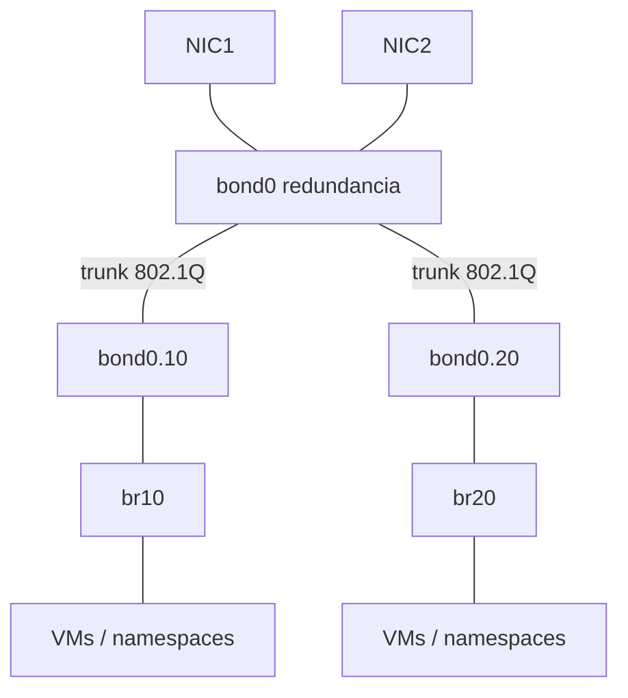

# Bonding, Bridging y VLANs

> [!abstract] TL;DR
> - **Bonding** agrega varias interfaces físicas o lógicas para resiliencia y, según el modo, balanceo.
> - **Bridging** convierte a Linux en un switch L2 software que forwardea tramas según MAC/FDB.
> - **VLANs** segmentan dominios L2 dentro del mismo enlace físico usando tags 802.1Q.
> - Combinadas, estas tres técnicas permiten construir uplinks redundantes, segmentación y topologías de virtualización o contenedores sin hardware dedicado extra.

## Concepto

Aunque suelen aparecer juntas, resuelven problemas distintos:

- **Bonding**: disponibilidad y/o agregación de enlaces.
- **Bridging**: unión de puertos dentro de un dominio de broadcast.
- **VLAN**: separación lógica de dominios L2 sobre el mismo trunk.



El error clásico es tratarlos como sinónimos. No lo son. Un bridge no reemplaza un bond; una VLAN no agrega redundancia; un bond no segmenta broadcast.

## Cómo funciona

### Bonding

El driver de bonding presenta una interfaz lógica (`bond0`) arriba de múltiples slaves. El comportamiento depende del modo:

- `active-backup`: una NIC activa, otra en espera. Muy usado en server por simplicidad y predictibilidad.
- `802.3ad`: LACP. Requiere soporte y configuración coherente en el switch.
- `balance-rr`, `balance-xor`, `broadcast`, otros: casos más específicos, con trade-offs claros.

### Bridging

Un bridge Linux aprende MACs por puerto y forwardea:

- unicast conocido: solo al puerto correspondiente
- broadcast/unknown unicast: flooding controlado
- puede aplicar STP y VLAN filtering

### VLANs

Una VLAN añade un tag 802.1Q a la trama para distinguir dominios L2 independientes sobre el mismo enlace.

- **Access port**: una sola VLAN sin tag hacia el endpoint.
- **Trunk**: múltiples VLANs taggeadas.
- En Linux, una interfaz tipo `eth0.20` representa la subinterfaz VLAN 20 sobre `eth0`.

> [!note]
> En hosts de virtualización o contenedores, lo habitual es combinar las tres: bond físico, trunk VLAN, bridges por segmento.

## Comandos / configuración

### VLAN simple con `ip`

```bash
sudo ip link add link eth0 name eth0.20 type vlan id 20
sudo ip addr add 198.51.100.10/24 dev eth0.20
sudo ip link set dev eth0 up
sudo ip link set dev eth0.20 up
```

### Bridge simple

```bash
sudo ip link add br0 type bridge
sudo ip link set dev eth1 master br0
sudo ip link set dev br0 up
sudo ip link set dev eth1 up

bridge link
bridge fdb show
```

### Bonding con `ip` y sysfs

La creación exacta varía por distro y módulo, pero conceptualmente:

```bash
sudo modprobe bonding
sudo ip link add bond0 type bond mode active-backup
sudo ip link set dev eth1 down
sudo ip link set dev eth2 down
sudo ip link set dev eth1 master bond0
sudo ip link set dev eth2 master bond0
sudo ip link set dev bond0 up
sudo ip link set dev eth1 up
sudo ip link set dev eth2 up
```

Inspección útil:

```bash
ip -d link show bond0
cat /proc/net/bonding/bond0
bridge vlan show
```

Ejemplo de diseño operativo:

```text
bond0        -> uplink redundante al switch
bond0.10     -> VLAN servidores
bond0.20     -> VLAN gestión
br-mgmt      -> bridge para VMs de gestión
```

> [!tip]
> Si el objetivo es solamente alta disponibilidad en servidores, `active-backup` suele ser la opción menos sorpresiva. `802.3ad` da más capacidad, pero también más maneras de equivocarse entre host y switch.

## Troubleshooting

| Síntoma | Causa probable | Comando de diagnóstico |
|---------|----------------|------------------------|
| El bond levanta pero no pasa tráfico | Modo no compatible con el switch o slaves mal negociadas | `cat /proc/net/bonding/bond0`, `ethtool eth1` |
| Solo una VLAN funciona | Native VLAN inconsistente o tag ID incorrecto | `bridge vlan show`, revisar switch y `ip -d link` |
| Broadcast excesivo o loops | Bridge sin STP o topología mal conectada | `bridge link`, `bridge fdb show`, `tcpdump -e -ni br0` |
| La VM no ve la red esperada | Bridge equivocado o interfaz no anexada | `bridge link`, `ip addr`, configuración del hypervisor |
| Intermitencia bajo carga | Hash LACP, MTU desigual o NICs con distinta capacidad | `cat /proc/net/bonding/bond0`, `ip link`, métricas del switch |

> [!warning]
> En L2, un pequeño error escala rápido. Una VLAN mal etiquetada o un bridge que genera loop no degrada "un servicio": puede impactar un segmento entero.

## Seguridad / ofensiva

### Riesgos y abuso ofensivo

- Un trunk expuesto a un host no confiable amplía superficie para enumerar o intentar acceder a VLANs no previstas.
- Bridges mal aislados pueden unir segmentos que defensivamente deberían permanecer separados.
- Configuraciones débiles de switchport todavía permiten escenarios de VLAN hopping o abuso de doble tagging en entornos mal diseñados.

### Perspectiva de Red Team

En un host comprometido, estas preguntas son clave:

- ¿Hay más de una NIC o bond?
- ¿El host participa en múltiples VLANs?
- ¿Hay bridges que conecten contenedores, VMs o namespaces con redes internas?

Comandos útiles:

```bash
ip -br link
ip -d link
bridge vlan show
bridge link
cat /proc/net/bonding/bond0
```

Eso permite inferir segmentación, dominios de broadcast, rutas de pivote y visibilidad lateral.

### Perspectiva defensiva

- Restringir trunks a donde realmente se necesitan.
- Auditar native VLAN y pruning.
- Usar STP o equivalentes donde corresponda.
- Documentar con precisión qué bridge conecta qué segmento.

> [!danger]
> Un bridge Linux conectado a un trunk sin filtrado correcto puede transformar un host común en un punto de tránsito entre segmentos. En términos defensivos, eso es expandir la blast radius de manera innecesaria.

## Relacionado

- [[ethernet-y-arp]] (fundamentos L2)
- [[interfaces-ip-link-addr-route]] (interfaces base y subinterfaces)
- [[iproute2-suite-ss-ip-bridge]] (herramientas de inspección)

## Referencias

- IEEE 802.1Q overview en documentación oficial de Linux bridge/VLAN
- `man ip-link`
- `man bridge`
- [Linux kernel documentation - bonding](https://docs.kernel.org/networking/bonding.html)
- [Linux kernel documentation - bridge](https://docs.kernel.org/networking/bridge.html)
- [Linux kernel documentation - switchdev and bridge VLAN filtering](https://docs.kernel.org/networking/switchdev.html)
