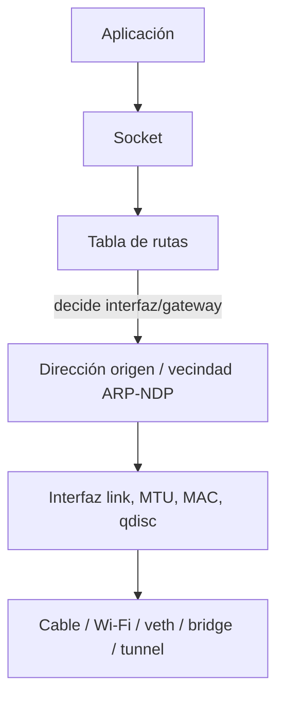
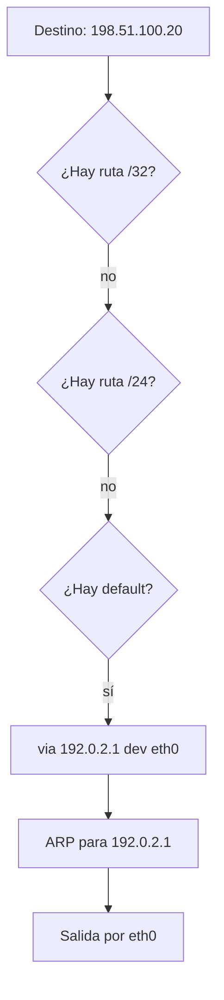

# Interfaces, ip link, ip addr y ip route

> [!abstract] TL;DR
> - En Linux moderno, la interfaz se administra con `iproute2`, no con `ifconfig` ni `route`.
> - `ip link` opera sobre el enlace y el estado de la interfaz; `ip addr` administra direcciones L3; `ip route` decide por dónde sale el tráfico.
> - Si entendés estas tres piezas, podés leer casi cualquier problema de conectividad local, default gateway, rutas específicas o lab de pivoting.
> - La interfaz no "tiene Internet": tiene estado, direcciones, vecinos y rutas. La salida efectiva es el resultado de todo eso combinado.

## Concepto

Una interfaz de red en Linux es el punto de acoplamiento entre el kernel y un medio de transporte: NIC física, veth, bridge, VLAN, túnel, loopback. Pensarla solo como "placa de red" se queda corta. Para el kernel, cada interfaz es un objeto con atributos de capa 2, direcciones de capa 3, colas, métricas y asociación a tablas de routing.

La separación práctica es:

- **`ip link`**: identidad y estado del dispositivo (`UP`, `DOWN`, MTU, MAC, tipo).
- **`ip addr`**: direcciones IPv4/IPv6 y prefijos asociados.
- **`ip route`**: tabla de decisión para reenviar paquetes.



> [!note]
> El comando `ip` no "hace magia". Habla con el kernel vía netlink. Eso importa porque casi todos los cambios son inmediatos, introspectables y scriptables.

## Cómo funciona

Cuando una aplicación genera tráfico hacia `198.51.100.20`, el kernel sigue una secuencia bastante determinista:

1. Evalúa la tabla de rutas más específica para ese destino.
2. Selecciona interfaz de salida y, si corresponde, next hop.
3. Elige la IP origen adecuada según prefijo, política y ruta.
4. Resuelve la MAC del vecino con ARP o NDP si el destino es on-link o si necesita hablar con el gateway.
5. Emite la trama por la interfaz elegida.

Ejemplo simple:



Dos matices operativos importantes:

- Una interfaz puede estar `UP` administrativamente pero no tener carrier físico o asociación real.
- Una IP puede estar bien configurada y aun así no servir para llegar al destino si la tabla de rutas está mal, el prefijo no coincide o el gateway no es alcanzable.

> [!tip]
> Cuando algo "no sale", pensá en esta tríada: `link`, `addr`, `route`. Si revisás las tres en ese orden, normalmente encontrás la falla rápido.

## Comandos / configuración

```bash
# Ver todas las interfaces y su estado de enlace
ip link show

# Levantar o bajar una interfaz
sudo ip link set dev eth0 up
sudo ip link set dev eth0 down

# Ajustar MTU y dirección MAC
sudo ip link set dev eth0 mtu 1400
sudo ip link set dev eth0 address 02:00:00:00:00:10

# Ver direcciones IPv4/IPv6
ip addr show
ip -4 addr show dev eth0
ip -6 addr show dev eth0

# Agregar o quitar una IP de forma temporal
sudo ip addr add 192.0.2.10/24 dev eth0
sudo ip addr add 2001:db8:10::10/64 dev eth0
sudo ip addr del 192.0.2.10/24 dev eth0

# Ver tabla de rutas principal
ip route show
ip -4 route show

# Agregar default gateway y rutas específicas
sudo ip route add default via 192.0.2.1 dev eth0
sudo ip route add 198.51.100.0/24 via 192.0.2.254 dev eth0
sudo ip route add 203.0.113.50/32 via 192.0.2.254 dev eth0

# Preguntarle al kernel qué ruta usaría
ip route get 198.51.100.20
```

Salida típica:

```text
$ ip route get 198.51.100.20
198.51.100.20 via 192.0.2.1 dev eth0 src 192.0.2.10 uid 1000
    cache
```

Eso te dice cuatro cosas valiosas:

- gateway elegido: `192.0.2.1`
- interfaz de salida: `eth0`
- IP origen efectiva: `192.0.2.10`
- que el kernel ya resolvió una decisión concreta para ese flujo

Persistencia: los comandos `ip` suelen ser **temporales**. Sobreviven hasta reinicio o reconfiguración del servicio de red. La persistencia real depende de `systemd-networkd`, `NetworkManager`, `netplan` o scripts de la distro.

## Troubleshooting

| Síntoma | Causa probable | Comando de diagnóstico |
|---------|----------------|------------------------|
| La interfaz existe pero no hay tráfico | Interfaz `DOWN`, sin carrier o conectada a bridge/VLAN distinta a la esperada | `ip link show`, `ethtool eth0` |
| Tenés IP pero no llegás ni al gateway | Prefijo mal puesto o gateway fuera de subred | `ip addr show`, `ip route get 192.0.2.1` |
| Llegás al gateway pero no a Internet | Default route ausente o DNS no relacionado con el problema inicial | `ip route show`, `ping -c 3 8.8.8.8` |
| El host responde desde una IP "rara" | Selección de source IP por múltiples direcciones o rutas | `ip route get <destino>`, `ip addr show` |
| Cambiaste algo y "se perdió" al reiniciar | Configuración temporal con `ip`, sin persistencia | revisar `systemd-networkd`, `NetworkManager` o `netplan` |

> [!warning]
> `ping 8.8.8.8` no valida toda la red. Apenas confirma que existe una ruta IP funcional hacia ese destino. No prueba DNS, MTU correcta, políticas ni reachability a redes internas.

## Seguridad / ofensiva

En post-exploitation, dominar `ip link`, `ip addr` y `ip route` sirve para tres cosas: entender dónde estás parado, no romper el acceso del operador y construir caminos de pivoting más discretos.

### Recon local del host comprometido

```bash
ip -br link
ip -br addr
ip route
ip neigh
```

Con eso podés inferir:

- si estás en una VM, contenedor o bare metal
- cuántas redes toca ese host
- cuál es el gateway real
- qué vecinos L2 ya vio el kernel

### Rutas temporales para pivoting

Si levantás un túnel o una interfaz adicional, podés enrutar solo una red objetivo sin tocar la default route:

```bash
sudo ip route add 10.20.30.0/24 via 192.0.2.254 dev eth0
```

Eso reduce ruido y baja el riesgo de cortarte tu propio C2.

### Abuso y detección

- Un atacante con privilegios puede insertar rutas host `/32` para desviar tráfico sensible.
- Cambiar MAC o MTU puede ayudar a evadir controles pobres, pero suele dejar huella en logs o monitoreo del switch.
- Interfaces efímeras como `tun0`, `wg0`, `veth*` o `br-*` son indicadores útiles para DFIR y threat hunting.

> [!danger]
> En un host remoto, **nunca** reemplaces la `default route` sin validar antes una ruta más específica o un canal de respaldo. El error clásico es perder la sesión de administración en el acto.

## Relacionado

- [[iproute2-suite-ss-ip-bridge]] (herramientas satélite de `iproute2`)
- [[routing-basico-tabla-rutas]] (lógica general de encaminamiento)
- [[network-namespaces]] (aislamiento de interfaces y tablas)

## Referencias

- RFC 791 - *Internet Protocol*
- RFC 1122 - *Requirements for Internet Hosts*
- RFC 1812 - *Requirements for IP Version 4 Routers*
- RFC 4291 - *IPv6 Addressing Architecture*
- `man ip`
- `man ip-link`
- `man ip-address`
- `man ip-route`
- [Linux kernel documentation - networking](https://docs.kernel.org/networking/index.html)
