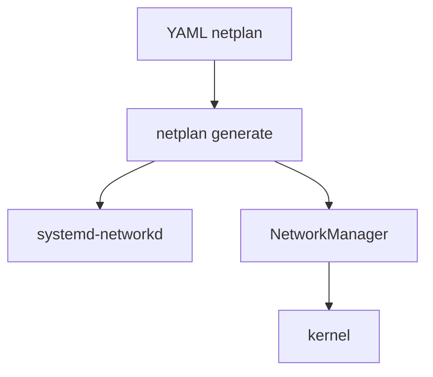

# Netplan

> [!abstract] TL;DR
> - `netplan` es una capa declarativa en YAML usada sobre todo en Ubuntu para definir red persistente.
> - No configura directamente el kernel: genera backend para un renderer, normalmente `systemd-networkd` o `NetworkManager`.
> - Es ideal para servidores y automatización cuando querés una sola fuente declarativa legible.
> - Si algo no aplica como esperabas, hay que depurar tres niveles: YAML, renderer generado y estado real del kernel.

## Concepto

`netplan` resuelve un problema de operación: escribir una sola configuración declarativa y delegar la ejecución al renderer adecuado.

Eso significa:

- **Netplan** describe intención.
- **Renderer** materializa esa intención.
- **Kernel** aplica el estado final.

No conviene pensar `netplan` como reemplazo de `ip`. Son planos distintos.



> [!note]
> Un error común es leer `ip addr` y culpar a `netplan`. Si la interfaz terminó con cierto estado, muchas veces la causa real está en el renderer o en una coincidencia incompleta de nombres/MACs.

## Cómo funciona

En distros que lo usan, `netplan` lee archivos en `/etc/netplan/*.yaml`. Cuando ejecutás `netplan generate` o `netplan apply`, traduce ese YAML al formato del renderer configurado.

Casos típicos:

- servidores Ubuntu: renderer `networkd`
- desktops Ubuntu: renderer `NetworkManager`

Podés definir:

- DHCP
- direcciones estáticas
- rutas
- nameservers
- bonds
- bridges
- VLANs
- reglas de matching por nombre o MAC

El valor real de `netplan` aparece cuando querés describir topologías medianamente complejas sin caer en scripts ad hoc.

## Comandos / configuración

Ejemplo simple estático con `networkd`:

```yaml
# /etc/netplan/01-lan.yaml
network:
  version: 2
  renderer: networkd
  ethernets:
    eth0:
      dhcp4: false
      addresses:
        - 192.0.2.10/24
      routes:
        - to: default
          via: 192.0.2.1
      nameservers:
        addresses:
          - 192.0.2.53
          - 192.0.2.54
```

Aplicación segura:

```bash
sudo netplan generate
sudo netplan try
sudo netplan apply
```

Ver backend generado:

```bash
sudo netplan get
sudo ls /run/systemd/network/
networkctl status
ip addr
ip route
```

Ejemplo con bridge y VLAN:

```yaml
network:
  version: 2
  renderer: networkd
  ethernets:
    eth1: {}
  vlans:
    vlan20:
      id: 20
      link: eth1
      addresses:
        - 198.51.100.10/24
  bridges:
    br0:
      interfaces: [vlan20]
      dhcp4: false
```

> [!tip]
> En acceso remoto, `netplan try` es obligatorio por disciplina. Si la config rompe conectividad, revierte sola tras timeout y te evita un viaje innecesario al rack o a la consola de hypervisor.

## Troubleshooting

| Síntoma | Causa probable | Comando de diagnóstico |
|---------|----------------|------------------------|
| `netplan apply` no falla, pero la interfaz queda mal | YAML válido, intención equivocada o renderer distinto al supuesto | `netplan get`, revisar `renderer`, `ip addr` |
| La config estática nunca aparece | El `match` no coincide con la interfaz real o el nombre cambió | `ip -br link`, revisar MAC/name |
| DNS no queda como en el YAML | `systemd-resolved`, DHCP o NM pisan valores | `resolvectl status`, `networkctl status`, `nmcli dev show` |
| Perdés acceso al aplicar cambios | Default route, bridge o bond mal definidos | `netplan try`, revisar consola fuera de banda |
| Config compleja se vuelve opaca | YAML excesivo sin comentarios operativos ni separación por archivos | dividir por propósito en `/etc/netplan/` |

> [!warning]
> No mezcles cambios manuales con `ip` esperando que `netplan` los "recuerde". Son capas distintas. `ip` cambia runtime; `netplan` define persistencia.

## Seguridad / ofensiva

### Visión defensiva

- Centraliza la intención de red en archivos fáciles de auditar.
- Reduce scripts heredados y drift manual.
- Facilita IaC y validación previa antes de desplegar.

### Visión ofensiva

En un host Ubuntu comprometido, `netplan` revela rápido:

- si la red es estática o DHCP
- qué renderer manda realmente
- qué bonds, bridges o VLANs existen
- qué nombres de servidores DNS y gateways están previstos

```bash
sudo netplan get
ls /etc/netplan/
```

Eso puede ayudar a entender segmentación, pivotes posibles y superficies de administración.

> [!danger]
> Manipular `netplan` para persistencia ofensiva deja artefactos muy visibles y suele disparar diffs de config, auditoría o problemas de servicio en el siguiente reinicio. En casi todos los escenarios, es una técnica ruidosa.

## Relacionado

- [[systemd-networkd-vs-networkmanager]] (renderers y trade-offs)
- [[interfaces-ip-link-addr-route]] (estado efectivo del kernel)
- [[bonding-bridging-vlans]] (topologías declaradas con netplan)

## Referencias

- `man netplan`
- [Netplan documentation](https://netplan.readthedocs.io/en/stable/)
- [Ubuntu Server Guide - Netplan](https://documentation.ubuntu.com/server/how-to/networking/install-netplan/)
- [systemd.network documentation](https://www.freedesktop.org/software/systemd/man/latest/systemd.network.html)
- [NetworkManager documentation](https://networkmanager.dev/docs/)
