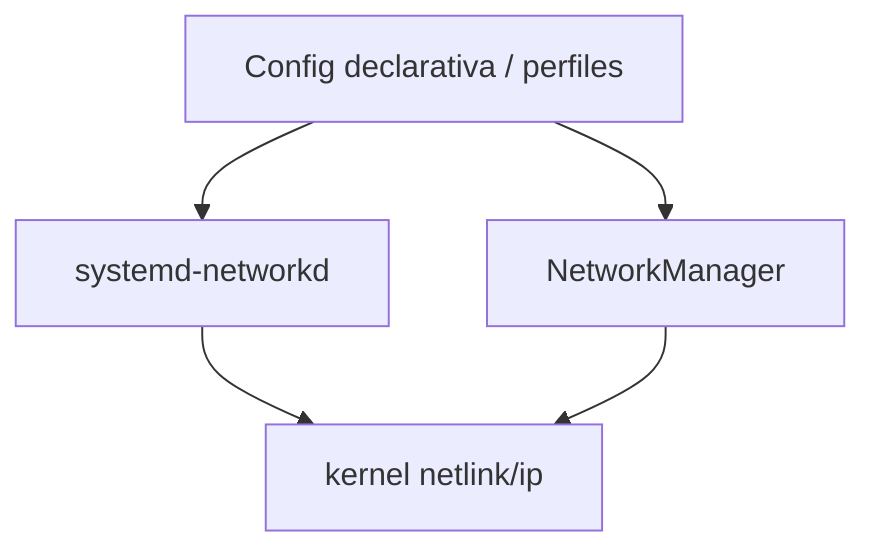

# systemd-networkd vs NetworkManager

> [!abstract] TL;DR
> - `systemd-networkd` y `NetworkManager` cumplen funciones parecidas: persistir y orquestar configuración de red en Linux.
> - `systemd-networkd` suele encajar mejor en servidores, VMs minimalistas, appliances e infraestructura declarativa.
> - `NetworkManager` sobresale en desktops, laptops, Wi-Fi, VPN de usuario y entornos donde cambia seguido el contexto de red.
> - El peor diseño no es elegir uno u otro: es mezclar ambos sobre la misma interfaz sin entender quién tiene la autoridad.

## Concepto

Los comandos `ip` aplican cambios inmediatos, pero no resuelven la operación diaria: reinicios, DHCP, DNS, perfiles, roaming, VLANs persistentes, hooks, integración con systemd, GUI o VPNs. Ahí entran los gestores de red.

La comparación correcta no es ideológica sino operativa:

- **`systemd-networkd`**: minimalista, orientado a servidor, declarativo, muy alineado con otros componentes de systemd.
- **`NetworkManager`**: más completo para experiencia de usuario, portátiles, Wi-Fi, perfiles dinámicos, VPNs y administración interactiva.



> [!note]
> Ninguno reemplaza al kernel ni a `iproute2`. Son capas de control sobre el mismo stack subyacente.

## Cómo funciona

### systemd-networkd

Lee archivos `.network`, `.netdev` y `.link`, luego configura interfaces mediante netlink durante el boot o cuando aparecen dispositivos. Se integra muy bien con:

- `systemd-resolved`
- unidades systemd
- hosts sin entorno gráfico
- despliegues reproducibles

Tiene un modelo simple: archivos en disco, servicio residente, estado relativamente predecible.

### NetworkManager

Mantiene perfiles de conexión y decide qué activar según contexto. Suele coordinar:

- Ethernet
- Wi-Fi
- VPN
- WWAN
- bridges, bonds, VLANs
- integración con desktop y secretos

Es excelente cuando la red cambia según ubicación, SSID, cable conectado, usuario logueado o VPN requerida.

### Conflicto clásico

Si ambos administran `eth0`, aparecen síntomas como:

- rutas que "vuelven" solas
- DNS que cambia sin explicación aparente
- interfaces que suben y bajan
- DHCP lease duplicado o reescrito

## Comandos / configuración

### Inspección de systemd-networkd

```bash
systemctl status systemd-networkd
networkctl status
networkctl list
journalctl -u systemd-networkd -b
```

Ejemplo mínimo:

```ini
# /etc/systemd/network/10-eth0.network
[Match]
Name=eth0

[Network]
Address=192.0.2.10/24
Gateway=192.0.2.1
DNS=192.0.2.53
```

### Inspección de NetworkManager

```bash
systemctl status NetworkManager
nmcli device status
nmcli connection show
nmcli connection show "<perfil>"
journalctl -u NetworkManager -b
```

Ejemplo mínimo:

```bash
sudo nmcli connection add type ethernet ifname eth0 con-name lan-static \
  ipv4.method manual ipv4.addresses 192.0.2.10/24 ipv4.gateway 192.0.2.1 \
  ipv4.dns "192.0.2.53 192.0.2.54"
```

> [!tip]
> En servidores, elegí un único source of truth. Si usás `networkd`, dejá `NetworkManager` fuera del camino para esas interfaces, y viceversa.

## Troubleshooting

| Síntoma | Causa probable | Comando de diagnóstico |
|---------|----------------|------------------------|
| La IP manual reaparece como DHCP o cambia sola | Otro gestor está reconfigurando la interfaz | `systemctl status systemd-networkd NetworkManager`, `nmcli device status`, `networkctl status` |
| DNS inconsistente | `systemd-resolved`, DHCP o NM empujando nameservers distintos | `resolvectl status`, `nmcli dev show`, logs del gestor |
| El servicio levanta pero la red no queda estable | Archivo `.network` no matchea interfaz o perfil NM mal asociado | `networkctl status`, `nmcli connection show` |
| En boot remoto perdés conectividad | Dependencia de orden, interfaz renombrada o renderer incorrecto | `journalctl -b`, `ip -br link` |
| Wi-Fi o VPN no funcionan bien en server minimal | `networkd` no es la herramienta más cómoda para ese caso de uso | reevaluar uso de `NetworkManager` |

> [!warning]
> `systemctl is-active` no alcanza. El servicio puede estar activo y, aun así, no estar gestionando la interfaz correcta o estar siendo sobreescrito por otro componente.

## Seguridad / ofensiva

### Perspectiva defensiva

- Menos componentes implica menos complejidad operativa y menos puntos ciegos.
- Config declarativa en `networkd` facilita auditoría e infraestructura reproducible.
- `NetworkManager` agrega comodidad, pero también más superficie en D-Bus, plugins, secretos y perfiles.

### Perspectiva ofensiva

En un host comprometido, identificar el gestor correcto acelera mucho la persistencia o el movimiento lateral:

```bash
systemctl status systemd-networkd NetworkManager
nmcli connection show
networkctl list
```

Con eso podés inferir:

- dónde persiste la config
- si hay perfiles VPN reutilizables
- si el host depende de DHCP o DNS inyectado por red
- si un cambio temporal con `ip` será revertido por el gestor

> [!danger]
> Persistir una ruta, DNS o túnel en el gestor equivocado puede romper producción o dejar evidencia muy obvia. En Red Team, el cambio "persistente pero ruidoso" suele ser peor que el temporal y quirúrgico.

## Relacionado

- [[netplan]] (capa declarativa usada por varias distros)
- [[interfaces-ip-link-addr-route]] (estado vivo del kernel)
- [[resolv-conf-y-systemd-resolved]] (resolución de nombres)

## Referencias

- `man systemd-networkd`
- `man systemd.network`
- `man networkctl`
- `man nmcli`
- [systemd.network documentation](https://www.freedesktop.org/software/systemd/man/latest/systemd.network.html)
- [NetworkManager documentation](https://networkmanager.dev/docs/)
