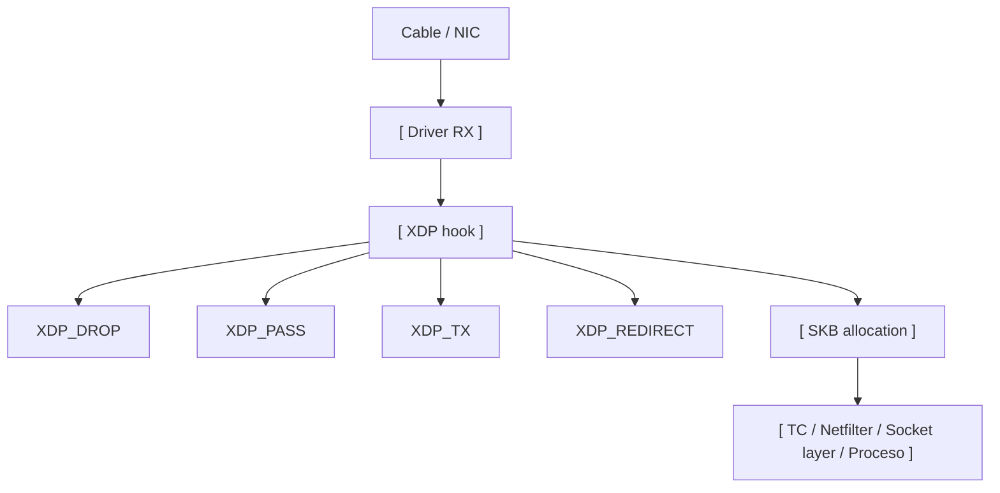

# eBPF y XDP para filtering moderno

> [!abstract] TL;DR
> - **eBPF** permite ejecutar programas verificados dentro del kernel para observabilidad, networking y enforcement fino.
> - **XDP** (eXpress Data Path) engancha esos programas muy temprano, en el driver de red o capa equivalente, antes de gran parte del stack clásico.
> - Para descarte masivo, rate limiting temprano o steering de tráfico, XDP puede rendir mucho mejor que filtrar recién en iptables/nftables.
> - No reemplaza automáticamente a nftables: resuelve otro tramo del problema. XDP es bisturí de alto rendimiento; nftables sigue siendo excelente policy engine generalista.

## Concepto

`eBPF` es un entorno de ejecución dentro del kernel con reglas estrictas:

- bytecode verificado antes de cargar,
- acceso controlado a helpers,
- mapas (`maps`) para estado compartido,
- hooks en distintos subsistemas.

`XDP` es uno de esos hooks y aparece extremadamente temprano en el camino del paquete. Eso significa que podés:

- dropear antes de asignar `skb`,
- reducir costo de CPU por paquete,
- reaccionar con latencia muy baja,
- desviar tráfico antes de que entre al stack completo.

La diferencia conceptual fuerte es esta:

- **nftables/iptables**: decisión dentro del stack tradicional de netfilter.
- **XDP**: decisión casi en la puerta de entrada de la NIC.

## Cómo funciona

### Punto de enganche



Si el programa decide `XDP_DROP`, el paquete muere antes de consumir bastante del costo normal del stack.

### Modos de operación

- **Native/driver mode**: mejor rendimiento. El driver soporta XDP directamente.
- **Generic mode**: fallback más lento, útil para pruebas o drivers sin soporte nativo.
- **Offload**: parte de la lógica puede ejecutarse en hardware compatible.

### Acciones típicas

- `XDP_PASS`: dejar pasar al stack normal.
- `XDP_DROP`: descartar.
- `XDP_TX`: retransmitir por la misma interfaz.
- `XDP_REDIRECT`: mandar a otra interfaz, CPU o AF_XDP socket.

### Estado y mapas

Los programas BPF suelen apoyarse en maps para:

- contadores,
- allowlists/blocklists,
- rate limiting,
- decisiones por prefijo IP,
- telemetría para user space.

Eso permite un patrón potente: datapath muy rápido en kernel, control plane en user space.

> [!note]
> El verificador de eBPF es estricto a propósito. Si te rechaza el programa, muchas veces no es "capricho": te está evitando loops peligrosos, accesos inválidos o caminos no acotados dentro del kernel.

## Comandos / configuración

Inspección del entorno:

```bash
# Ver programas BPF cargados
sudo bpftool prog show

# Ver maps
sudo bpftool map show

# Ver detalles de la interfaz
ip -details link show dev eth0
```

Adjuntar un programa XDP con herramientas comunes:

```bash
# Con xdp-loader (xdp-tools)
sudo xdp-loader load eth0 /opt/xdp/dropper.o --progsec xdp

# Ver estado
sudo xdp-loader status eth0

# Descargar
sudo xdp-loader unload eth0
```

Inspección y trazas:

```bash
# Ver programas y BTF asociado
sudo bpftool prog show

# Dump de mapas en formato legible
sudo bpftool map dump id 17

# Mensajes del kernel relacionados a carga/verificador
sudo dmesg | rg -i "bpf|xdp"
```

Complemento con `tc` cuando necesitás actuar más tarde que XDP:

```bash
# Adjuntar BPF en clsact ingress
sudo tc qdisc add dev eth0 clsact
sudo tc filter add dev eth0 ingress bpf da obj /opt/xdp/filter.o sec tc

# Ver filtros
sudo tc filter show dev eth0 ingress
```

> [!tip]
> Si tu objetivo es DDoS filtering de alto volumen o descarte temprano por prefijos/puertos simples, XDP suele ser el primer lugar serio para mirar. Si tu objetivo es policy rica por servicio, sets, NAT y mantenimiento operativo, `nftables` suele seguir siendo más razonable.

## Troubleshooting

| Síntoma | Causa probable | Comando de diagnóstico |
|---------|----------------|------------------------|
| El programa no carga | Rechazo del verificador, falta de BTF, permisos o toolchain | `sudo dmesg | rg -i "bpf|xdp"`, `sudo bpftool prog show` |
| Carga, pero rinde poco | Está en modo generic y no native | `ip -details link show dev eth0`, `sudo xdp-loader status eth0` |
| Se cae tráfico legítimo | Match demasiado amplio o bug de parsing | `sudo bpftool map dump`, capturas paralelas con `tcpdump -ni eth0` |
| No ves el paquete en nftables/iptables | XDP lo está dropeando antes de llegar al stack | `sudo xdp-loader status eth0`, `sudo nft list ruleset` |
| El behavior cambia tras reinicio | Falta mecanismo persistente de carga | `systemctl status <servicio-de-carga>`, revisión de unidad/systemd asociada |

> [!warning]
> Troubleshooting de XDP exige recordar una cosa: si descartaste arriba del stack, herramientas clásicas más abajo pueden no ver absolutamente nada. No es que "desapareció" el tráfico; lo mataste antes de que naciera para el resto del sistema.

## Seguridad / ofensiva

### 1. Mitigación temprana de DDoS

XDP es especialmente fuerte para:

- drop por prefijos,
- filtros por puertos/protocolos simples,
- rate limiting por fuente,
- descarte de basura volumétrica antes de `conntrack`.

Eso protege CPU, memoria y tablas de estado.

### 2. Protección del plano de control

Un uso defensivo muy sano es filtrar ruido antes de que llegue a:

- `nf_conntrack`,
- sockets de servicios expuestos,
- telemetría de aplicación,
- balanceadores en software.

Si el kernel nunca tuvo que procesar ese paquete como `skb`, el costo evitado es real.

### 3. Riesgo operativo

La contracara es que un error en XDP pega muy temprano. Si te equivocás:

- cortás tráfico legítimo,
- rompés debugging tradicional,
- generás síntomas difíciles de correlacionar,
- podés dejar un host "sano" pero inaccesible.

### 4. Post-explotación y stealth

Desde una perspectiva ofensiva avanzada, eBPF puede usarse para observación o manipulación muy potente. Pero también es un área cada vez más controlada:

- capacidades requeridas,
- lockdown del kernel,
- telemetría de seguridad,
- auditoría de carga de programas BPF.

No es una zona libre. En hosts bien administrados, cargar BPF sin dejar huella ya no es trivial.

### 5. Dónde encaja frente a nftables

No lo plantees como reemplazo lineal:

- **XDP**: línea de defensa temprana, altísimo rendimiento, lógica acotada y precisa.
- **nftables**: policy engine general, NAT, sets, mantenimiento operativo más simple.

La arquitectura madura suele combinar ambos según necesidad.

> [!danger]
> Si metés lógica compleja, mutable y mal gobernada dentro de eBPF/XDP, trasladás deuda operativa del user space al kernel path. El rendimiento impresionante no compensa una plataforma imposible de operar a las 3 AM.

## Relacionado

- [[nftables-migracion-desde-iptables]] (Policy engine moderno generalista)
- [[iptables-conntrack-stateful]] (Estado que XDP puede aliviar o evitar)
- [[tcpdump-cheatsheet-y-bpf]] (BPF clásico para captura y filtrado)

## Referencias

- Linux kernel documentation - BPF: [https://docs.kernel.org/bpf/](https://docs.kernel.org/bpf/)
- Linux kernel documentation - XDP/RX metadata and networking sections: [https://docs.kernel.org/networking/](https://docs.kernel.org/networking/)
- `man bpftool`
- `man tc-bpf`
- xdp-tools project documentation: [https://github.com/xdp-project/xdp-tools](https://github.com/xdp-project/xdp-tools)
