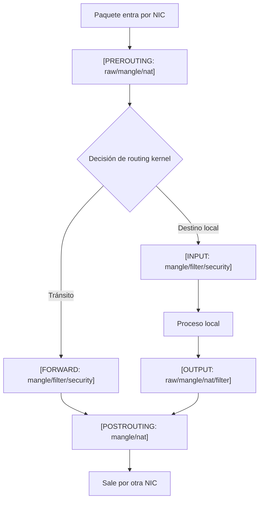

# iptables: tablas, chains y targets

> [!abstract] TL;DR
> - `iptables` es la interfaz clásica de espacio de usuario para programar reglas sobre **Netfilter** en el kernel Linux.
> - La lógica base es: **tabla -> chain -> regla -> target**. La tabla define el propósito, la chain el punto del recorrido del paquete y el target la acción final o el salto.
> - En la práctica, el orden importa más que la cantidad de reglas: `ACCEPT` temprano o `DROP` temprano cambia por completo el comportamiento.
> - En 2026, **iptables está deprecado como interfaz de diseño nuevo frente a nftables**. Sigue existiendo por compatibilidad, troubleshooting y legado, pero si arrancás de cero, diseñás en `nft`.

## Concepto

`iptables` no "es el firewall" en sí mismo. El motor real es **Netfilter**, una serie de hooks dentro del stack de red del kernel. `iptables` es el martillo viejo y conocido para insertar reglas en esos hooks.

Pensalo así:

- **Tabla**: el cajón de herramientas para un tipo de operación.
- **Chain**: el momento exacto del camino donde inspeccionás el paquete.
- **Regla**: la condición que matchea.
- **Target**: qué hacés cuando matchea.

No todas las tablas ven todos los paquetes ni en todos los momentos. Ese detalle explica la mitad de los errores operativos cuando alguien dice "abrí el puerto y sigue sin andar".

> [!warning]
> Si mezclás conceptos de `filter`, `nat` y `mangle`, terminás armando reglas correctas en la tabla equivocada. Ahí el problema no es sintaxis: es modelo mental.

## Cómo funciona

### Tablas principales

Las tablas clásicas más relevantes en IPv4 son:

- **`filter`**: filtrado puro. Es donde vivían y viven la mayoría de reglas `ACCEPT`/`DROP`.
- **`nat`**: traducción de direcciones y puertos. Se usa para `SNAT`, `DNAT`, `MASQUERADE`, `REDIRECT`.
- **`mangle`**: modificación de campos del paquete, marcas (`MARK`), TOS/TTL y manipulación avanzada.
- **`raw`**: decisiones tempranas antes de conntrack, por ejemplo `NOTRACK`.
- **`security`**: integración con mecanismos MAC como SELinux.

### Chains integradas

Las chains built-in más importantes son:

- **`PREROUTING`**: entra el paquete antes de decidirse a dónde rutearlo.
- **`INPUT`**: paquete destinado al host local.
- **`FORWARD`**: paquete que atraviesa el host hacia otro destino.
- **`OUTPUT`**: tráfico generado por el host local.
- **`POSTROUTING`**: sale el paquete después de decidir la ruta.

### Recorrido mental mínimo



### Targets: qué puede hacer una regla

Un target puede ser:

- **Terminal**: corta el recorrido en esa chain.
  - `ACCEPT`
  - `DROP`
  - `REJECT`
- **No terminal**: modifica algo y sigue.
  - `LOG`
  - `MARK`
  - `CONNMARK`
- **De salto**:
  - `DNAT`
  - `SNAT`
  - `MASQUERADE`
  - `REDIRECT`
  - salto a una **user-defined chain**

### Políticas por defecto

Cada chain base puede tener una policy, por ejemplo:

- `INPUT DROP`
- `FORWARD DROP`
- `OUTPUT ACCEPT`

Eso define qué pasa si ninguna regla matchea. Un diseño conservador típico en un host expuesto es:

1. default deny en `INPUT`,
2. aceptar loopback,
3. aceptar `ESTABLISHED,RELATED`,
4. abrir explícitamente lo necesario.

> [!tip]
> La regla más barata es la que nunca se evalúa. Poné primero lo más frecuente y lo más seguro: loopback, `ESTABLISHED,RELATED`, y después excepciones puntuales.

## Comandos / configuración

Listar reglas con contexto:

```bash
sudo iptables -L -n -v
sudo iptables -t nat -L -n -v
sudo iptables -S
sudo iptables-save
```

Base mínima de host endurecido:

```bash
# Limpiar reglas de la tabla filter
sudo iptables -F

# Políticas por defecto
sudo iptables -P INPUT DROP
sudo iptables -P FORWARD DROP
sudo iptables -P OUTPUT ACCEPT

# Tráfico local
sudo iptables -A INPUT -i lo -j ACCEPT

# Conexiones ya establecidas o relacionadas
sudo iptables -A INPUT -m conntrack --ctstate ESTABLISHED,RELATED -j ACCEPT

# SSH de administración desde una red interna RFC 1918
sudo iptables -A INPUT -p tcp -s 10.20.30.0/24 --dport 22 -j ACCEPT

# HTTPS público
sudo iptables -A INPUT -p tcp --dport 443 -j ACCEPT

# Rechazo explícito para troubleshooting más claro
sudo iptables -A INPUT -p tcp --dport 8443 -j REJECT --reject-with tcp-reset
```

Ejemplos de NAT:

```bash
# DNAT: publicar un servicio interno
sudo iptables -t nat -A PREROUTING -p tcp -d 198.51.100.10 --dport 443 -j DNAT --to-destination 10.10.20.15:8443

# SNAT fijo: útil si el host tiene IP pública estable
sudo iptables -t nat -A POSTROUTING -s 10.10.20.0/24 -o eth0 -j SNAT --to-source 198.51.100.10

# MASQUERADE: útil si la IP externa cambia
sudo iptables -t nat -A POSTROUTING -s 10.10.20.0/24 -o eth0 -j MASQUERADE
```

Persistencia depende de la distro:

```bash
# Exportar reglas actuales
sudo iptables-save > /etc/iptables/rules.v4

# Restaurar reglas
sudo iptables-restore < /etc/iptables/rules.v4
```

> [!note]
> En sistemas modernos, `iptables` puede estar usando el backend `nf_tables` mediante compatibilidad (`iptables-nft`) o el backend legado (`iptables-legacy`). Antes de diagnosticar, confirmá cuál tenés.

## Troubleshooting

| Síntoma | Causa probable | Comando de diagnóstico |
|---------|----------------|------------------------|
| La regla "está" pero no matchea | Está en la tabla o chain equivocada | `sudo iptables -t nat -L -n -v`, `sudo iptables -t filter -L -n -v` |
| Abriste un puerto y sigue habiendo timeout | Falta retorno `ESTABLISHED,RELATED`, o el servicio escucha en otra IP/interfaz | `ss -tulpn`, `sudo iptables -L INPUT -n -v` |
| El tráfico pasa localmente pero no al rutear | `FORWARD` en `DROP`, o `net.ipv4.ip_forward=0` | `sysctl net.ipv4.ip_forward`, `sudo iptables -L FORWARD -n -v` |
| NAT publicado pero el backend no responde | DNAT correcto pero falta ruta de vuelta, o firewall del backend | `ip route`, `tcpdump -ni any host 10.10.20.15` |
| Contadores en cero | La regla está después de otra más general que ya acepta o dropea | `sudo iptables -S` |

> [!danger]
> No cambies policies remotas por SSH sin una regla previa que preserve tu sesión actual. El clásico "me cerré el acceso administrando por VPN" sigue siendo una de las maneras más ridículas de perder una ventana de mantenimiento.

## Seguridad / ofensiva

Desde la óptica defensiva, `iptables` sigue apareciendo en hosts legacy, appliances viejos, laboratorios y playbooks heredados. Ignorarlo sería ingenuo.

### 1. Orden de reglas y sombra operacional

Una regla más amplia antes que una más específica genera **shadowing**:

- `ACCEPT tcp/0.0.0.0/0 dpt:443`
- después intentás bloquear `203.0.113.25`

Ese bloqueo nunca corre. El problema no es "el firewall no anda"; el problema es que ya tomaste la decisión antes.

### 2. `REJECT` vs `DROP`

- **`DROP`** da silencio, sube el costo del reconocimiento y complica troubleshooting.
- **`REJECT`** da feedback rápido, útil adentro de una red administrada.

Para perímetro hostil y superficie expuesta, el silencio suele ser preferible. Para debugging interno, `REJECT` te ahorra horas.

### 3. Exposición de topología por reglas mal pensadas

Un `DNAT` a `10.10.20.15:8443` combinado con banners, certificados o respuestas distintas puede filtrar:

- existencia de backend interno,
- puertos reales,
- segmentación de red,
- asimetrías entre WAF/reverse proxy y servicio de origen.

### 4. Enumeración post-explotación

En post-compromise, revisar reglas locales te dice mucho:

- qué puertos están permitidos saliendo,
- qué redes internas se consideran de confianza,
- si hay NAT o reenvíos útiles para pivoting,
- si el host filtra por interfaz, origen o marca.

`iptables-save`, `ip route`, `ss -tulpn` y `sysctl net.ipv4.ip_forward` suelen dar una imagen bastante fiel del plano de control de ese host.

> [!warning]
> En 2026, si ves `iptables` en un sistema nuevo, preguntate si es una decisión consciente o deuda técnica. Muchas distros ya operan sobre `nftables` aunque la interfaz visible siga siendo el comando `iptables`.

## Relacionado

- [[iptables-conntrack-stateful]] (Seguimiento de estados y filtrado stateful)
- [[nftables-migracion-desde-iptables]] (Arquitectura moderna y migración)
- [[ufw-firewalld-wrappers]] (Wrappers que abstraen reglas)

## Referencias

- RFC 3022 - *Traditional IP Network Address Translator (Traditional NAT)*
- `man iptables`
- `man iptables-extensions`
- `man iptables-save`
- `man iptables-restore`
- Netfilter project documentation: [https://www.netfilter.org/documentation/](https://www.netfilter.org/documentation/)
