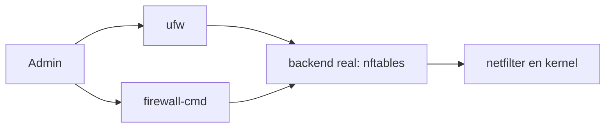

# UFW y firewalld como wrappers de firewall

> [!abstract] TL;DR
> - **UFW** y **firewalld** no son motores de filtrado distintos: son capas de administración arriba del firewall del kernel.
> - En 2026, en la mayoría de distros modernas, ambos suelen operar sobre **nftables**; el backend `iptables` queda mayormente como legado.
> - `UFW` prioriza simplicidad de host. `firewalld` prioriza administración dinámica, zonas, servicios y automatización más rica.
> - El error operativo típico es creer que la salida de `ufw status` o `firewall-cmd --list-all` agota la verdad. La verdad final está en el ruleset efectivo del kernel.

## Concepto

Estos wrappers existen porque escribir policy directamente en `iptables` o `nft` no siempre es lo más cómodo para operación diaria.

La diferencia de enfoque es clara:

- **UFW (Uncomplicated Firewall)**: interfaz minimalista y opinionada, muy común en Ubuntu y servidores chicos/medianos.
- **firewalld**: gestor dinámico orientado a zonas, servicios, integración con NetworkManager, libvirt y ambientes empresariales.

Ninguno reemplaza los conceptos de fondo:

- hooks,
- chains,
- conntrack,
- NAT,
- orden de evaluación.

Solo los abstrae.



## Cómo funciona

### UFW

UFW expone una sintaxis intencionalmente simple:

- `allow`
- `deny`
- `reject`
- `limit`

Internamente genera reglas ordenadas para:

- tráfico entrante,
- saliente,
- routed/forwarded si corresponde,
- logging,
- perfiles de aplicaciones.

Buen encastre para:

- hosts individuales,
- VPS,
- bastiones,
- admins que quieren bajo costo cognitivo.

### firewalld

firewalld trabaja con objetos más declarativos:

- **zones**: nivel de confianza por interfaz o red fuente,
- **services**: bundles de puertos/protocolos conocidos,
- **runtime** vs **permanent**: cambios temporales o persistentes,
- **rich rules**: expresividad adicional,
- **direct rules / policies**: casos más avanzados.

Buen encastre para:

- servidores con múltiples interfaces,
- integración con virtualización o desktop/network managers,
- automatización por D-Bus,
- ambientes donde cambia el contexto de red sin reiniciar firewall.

### La verdad de fondo

Aunque uses wrapper, seguís teniendo las mismas preguntas esenciales:

- ¿entra a `input`, `forward` u `output`?
- ¿hay estado `ESTABLISHED,RELATED`?
- ¿se aplicó `DNAT`/`SNAT`?
- ¿qué backend real está activo?

> [!warning]
> Si no sabés qué backend está usando el sistema, diagnosticar solo desde el wrapper es trabajar con sombras. Mirá también el ruleset efectivo con `nft`.

## Comandos / configuración

### UFW: ejemplos comunes

```bash
# Estado y reglas numeradas
sudo ufw status verbose
sudo ufw status numbered

# Política básica
sudo ufw default deny incoming
sudo ufw default allow outgoing

# Abrir SSH y HTTPS
sudo ufw allow 22/tcp
sudo ufw allow 443/tcp

# Limitar bruteforce básico de SSH
sudo ufw limit 22/tcp

# Permitir desde una red concreta
sudo ufw allow from 10.20.30.0/24 to any port 22 proto tcp

# Habilitar
sudo ufw enable
```

### firewalld: ejemplos comunes

```bash
# Estado general
sudo firewall-cmd --state
sudo firewall-cmd --get-default-zone
sudo firewall-cmd --get-active-zones

# Ver configuración de una zona
sudo firewall-cmd --zone=public --list-all

# Abrir servicios y puertos en runtime
sudo firewall-cmd --zone=public --add-service=https
sudo firewall-cmd --zone=public --add-port=8443/tcp

# Hacer persistente
sudo firewall-cmd --runtime-to-permanent

# Regla rica por origen
sudo firewall-cmd --permanent --zone=public \
  --add-rich-rule='rule family="ipv4" source address="10.20.30.0/24" port port="22" protocol="tcp" accept'

sudo firewall-cmd --reload
```

### Backend efectivo

```bash
# Ver ruleset real
sudo nft list ruleset

# Confirmar versión y backend
firewall-cmd --version
ufw version
iptables --version
```

> [!note]
> En hosts nuevos, si necesitás máxima claridad o reglas complejas, muchas veces conviene modelar directamente en `nftables`. El wrapper suma comodidad, pero también otra capa mental.

## Troubleshooting

| Síntoma | Causa probable | Comando de diagnóstico |
|---------|----------------|------------------------|
| Abriste el puerto en firewalld pero sigue cerrado tras reinicio | Lo agregaste en runtime y no en permanent | `sudo firewall-cmd --list-all`, `sudo firewall-cmd --runtime-to-permanent` |
| UFW muestra regla correcta pero el tráfico igual falla | Hay reglas del backend o de otro orquestador por debajo | `sudo ufw status verbose`, `sudo nft list ruleset` |
| Tráfico entra por una interfaz "equivocada" | Zona incorrecta o interfaz no asociada a la zona esperada | `sudo firewall-cmd --get-active-zones` |
| Docker/libvirt modifica conectividad | Inserta reglas propias y NAT aparte del wrapper | `sudo nft list ruleset`, `ip route`, `ss -tulpn` |
| Te bloqueaste por SSH al habilitar UFW | No abriste primero acceso de administración | `sudo ufw status numbered` desde consola local o acceso alternativo |

> [!tip]
> En `firewalld`, memorizá esta distinción o vas a perder tiempo: **runtime** es el estado vivo, **permanent** es el estado que sobrevive reload/reboot.

## Seguridad / ofensiva

### 1. Abstracción no elimina complejidad

Un wrapper puede simplificar el comando, pero no elimina:

- errores de segmentación,
- zonas mal asignadas,
- `forward` mal entendido,
- NAT implícito o inesperado,
- diferencia entre policy y excepción.

### 2. Enumeración rápida en post-compromise

Si caés en un host Linux y querés entender la política de red:

- `ufw status verbose`
- `firewall-cmd --list-all --zone=<zona>`
- `sudo nft list ruleset`

Esa combinación te dice:

- qué cree el operador que configuró,
- qué está realmente cargado,
- qué superficie de egreso o pivoting puede existir.

### 3. Riesgo clásico: confiar demasiado en "services"

En firewalld, un `service` puede abrir más de lo que el admin recuerda si asume solo "nombre amigable". Siempre validá qué puertos/protocolos incluye realmente ese servicio.

### 4. UFW y falsa sensación de simpleza

UFW es muy cómodo, pero detrás siguen existiendo:

- orden,
- estado,
- routed traffic,
- IPv4/IPv6,
- interacción con otros agentes.

La simpleza es de UX, no de física de red.

### 5. Backend legado

Si encontrás un sistema nuevo operando wrappers sobre backend `iptables` legado, tomalo como señal de revisión técnica. En 2026, la dirección recomendada es **nftables**. `iptables` sigue siendo importante para compatibilidad y lectura de ambientes heredados, no como punto de diseño estratégico nuevo.

> [!danger]
> No combines cambios manuales directos en `nft` con cambios frecuentes por UFW o firewalld sin un criterio claro de ownership. Cuando dos capas creen que administran el mismo plano, el incidente no tarda en aparecer.

## Relacionado

- [[nftables-migracion-desde-iptables]] (Backend moderno recomendado)
- [[iptables-tablas-chains-targets]] (Modelo clásico subyacente)
- [[iptables-conntrack-stateful]] (Estado y retorno de conexiones)

## Referencias

- `man ufw`
- `man ufw-framework`
- `man firewall-cmd`
- `man firewalld`
- firewalld official documentation: [https://firewalld.org/documentation/](https://firewalld.org/documentation/)
- Ubuntu Server documentation - UFW: [https://documentation.ubuntu.com/server/how-to/security/firewalls/](https://documentation.ubuntu.com/server/how-to/security/firewalls/)
