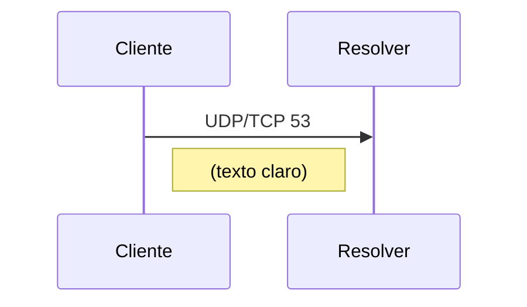
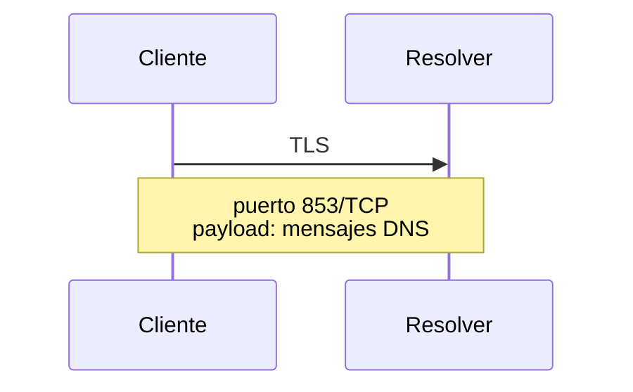
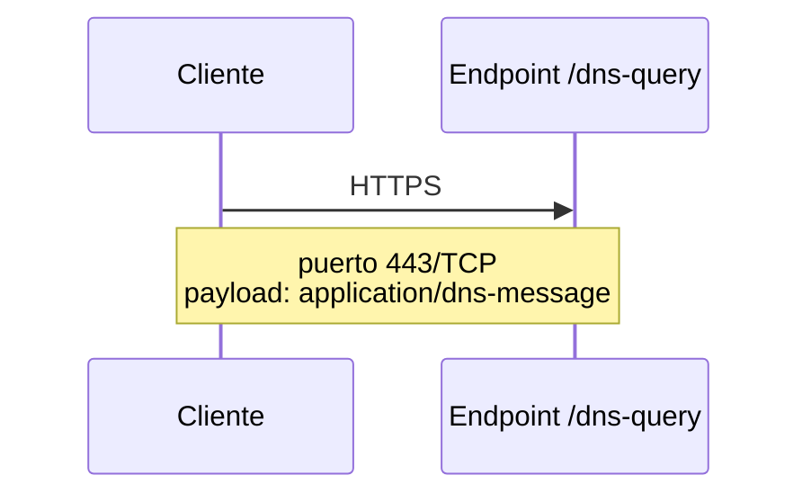

# DNS over TLS y DNS over HTTPS (DoT / DoH)

## TL;DR

- **DoT** encapsula DNS dentro de TLS dedicado, normalmente en puerto `853/TCP`.
- **DoH** encapsula DNS dentro de HTTPS, normalmente sobre `443/TCP`, usando HTTP/2 o HTTP/3.
- Ambos protegen confidencialidad e integridad en tránsito entre cliente y resolver, pero no vuelven "privado" todo el stack DNS automáticamente.
- DoH se mezcla con tráfico web y complica visibilidad de red; DoT es más fácil de identificar, permitir o bloquear por política.
- En empresas, el problema no es solo cifrar DNS: también hay que decidir quién resuelve, qué se registra y cómo se aplican controles.

## Concepto

DNS clásico nació sin cifrado. Una consulta común por UDP 53 es trivial de observar, alterar o bloquear en el camino. Eso expone:

- qué dominios consultan los equipos;
- patrones de navegación y software;
- nombres internos filtrados por error;
- metadata muy valiosa para profiling o censura.

DoT y DoH atacan ese problema: cifran el tramo entre stub/cliente y resolver. La diferencia central no está en "qué resuelven", sino en **cómo viaja** la consulta.

### Diferencia de enfoque

- **DoT:** DNS sobre una sesión TLS explícita y dedicada.
- **DoH:** DNS codificado como mensajes HTTP enviados dentro de una sesión HTTPS.

En ambos casos, el resolver sigue viendo tus queries. Lo que cambia es que terceros en el camino ya no leen fácilmente el contenido.

> [!note]
> Cifrar el transporte no elimina la necesidad de confiar en el resolver. Si migraste de un resolver corporativo a uno externo, mejoraste privacidad frente a la red local pero cambiaste el punto de confianza, no lo eliminaste.

## Cómo funciona

### DNS clásico



### DNS over TLS



Flujo simplificado:

1. Cliente abre TCP al resolver.
2. Negocia TLS.
3. Valida certificado del resolver.
4. Envía mensajes DNS dentro del canal cifrado.
5. Reutiliza la conexión para varias consultas.

### DNS over HTTPS



Flujo simplificado:

1. Cliente abre HTTPS al endpoint del resolver.
2. Negocia TLS como cualquier servicio web.
3. Envía la consulta DNS como request HTTP.
4. Recibe respuesta DNS como body HTTP.

### Comparación operativa

| Aspecto               | DoT                           | DoH                             |
| --------------------- | ----------------------------- | ------------------------------- |
| Puerto tipico         | 853/TCP                       | 443/TCP                         |
| Visibilidad           | Mas facil de identificar      | Se confunde con trafico web     |
| Intermediarios        | Menos capas                   | HTTP/TLS/proxy-aware            |
| Politicas de red      | Mas simple                    | Mas complejas                   |
| Cliente tipico        | OS / resolver local           | Navegadores y apps              |

### Qué no resuelven

- No cifran la resolución entre el resolver recursivo y todos los autoritativos, salvo que esa infraestructura también use mecanismos adicionales.
- No ocultan SNI o tráfico posterior del sitio consultado.
- No sustituyen DNSSEC: una cosa protege transporte; la otra, autenticidad de datos DNS.

> [!tip]
> DoT/DoH y DNSSEC no compiten. Se complementan. Uno protege el canal; el otro ayuda a validar el contenido.

## Comandos / configuración

### Probar DoT con `kdig`

```bash
kdig @resolver.example.net +tls-ca +tls-host=resolver.example.net example.com A
```

### Probar handshake TLS hacia un listener DoT

```bash
openssl s_client -connect resolver.example.net:853 -servername resolver.example.net
```

### Hacer una consulta DoH con `curl`

```bash
curl \
  -H 'accept: application/dns-message' \
  'https://resolver.example.net/dns-query?dns=q80BAAABAAAAAAAAB2V4YW1wbGUDY29tAAABAAE'
```

Ese parámetro `dns=` contiene el mensaje DNS codificado para transporte HTTP. Para pruebas humanas suele ser más cómodo usar clientes específicos (`kdig`, `drill`, bibliotecas o herramientas del navegador).

### `systemd-resolved` con DoT

Archivo:

```text
/etc/systemd/resolved.conf
```

Ejemplo:

```ini
[Resolve]
DNS=resolver.example.net
FallbackDNS=
Domains=~.
DNSOverTLS=yes
DNSSEC=allow-downgrade
```

Aplicar:

```bash
sudo systemctl restart systemd-resolved
resolvectl status
```

### Firefox con DoH

Firefox implementa políticas propias de DoH. En entornos corporativos conviene controlarlo mediante policy oficial y no asumir que "el navegador usa el DNS del sistema".

## Troubleshooting

| Síntoma | Causa probable | Comando de diagnóstico |
|---------|----------------|------------------------|
| DoT no conecta | Puerto `853/TCP` filtrado o certificado inválido | `openssl s_client -connect resolver.example.net:853 -servername resolver.example.net` |
| DoH falla pero web normal funciona | Endpoint `/dns-query` incorrecto, política del navegador o proxy intermedio | `curl -v https://resolver.example.net/dns-query` |
| Resolución lenta | Reintentos por fallback entre DNS clásico y cifrado, o handshake TLS costoso sin reuse | `resolvectl query example.com` y captura de tiempos |
| El SOC perdió visibilidad DNS | Apps/navegadores salieron por DoH directo a terceros | inspección de políticas de endpoint y egress |
| `SERVFAIL` solo con un resolver cifrado | Problema de validación DNSSEC, upstream roto o política del proveedor | probar contra otro resolver DoT/DoH y comparar |

### Cosas a validar en serio

1. Nombre del resolver y validez de certificado.
2. Política de fallback: si falla DoT/DoH, ¿cae a DNS claro o corta?
3. Interacción con proxy, firewall y TLS inspection.
4. Qué componente resuelve: OS, navegador o aplicación.

> [!warning]
> Si el navegador usa DoH hacia un tercero pero el sistema operativo usa el resolver corporativo, vas a tener dos planos de resolución coexistiendo. Eso puede romper troubleshooting, políticas y correlación forense.

## Seguridad / ofensiva

DoT y DoH mejoran privacidad, pero también cambian el juego de monitoreo y control.

### Impacto defensivo

- reducen visibilidad pasiva de consultas en redes intermedias;
- dificultan filtrado DNS por dispositivos que solo entienden UDP/TCP 53;
- obligan a mover controles hacia endpoint, proxy explícito o resolver corporativo cifrado;
- exigen inventariar qué software resuelve por su cuenta.

### Abuso y evasión

Un operador ofensivo puede preferir DoH porque:

- sale por `443/TCP`, más tolerado;
- se mezcla con tráfico HTTPS;
- evita algunos controles basados en DNS plano.

Pero también deja artefactos:

- conexiones a endpoints DoH conocidos;
- patrones de requests `/dns-query`;
- desalineación entre browsing y resolución observada por el resolver corporativo.

> [!danger]
> Permitir DoH libre hacia internet desde endpoints corporativos puede desactivar, de hecho, controles DNS centrales sin que el equipo de red lo advierta enseguida. El problema es de gobernanza, no solo técnico.

### Buenas prácticas

- ofrecer resolver corporativo con DoT/DoH propio;
- bloquear o gobernar resolvers externos por policy;
- loggear en el resolver, no en tránsito;
- distinguir telemetría de navegador, SO y agentes de seguridad.

## Relacionado

- [[dns-jerarquia-resolucion]]
- [[dig-nslookup-host-drill]]
- [[dns-caching-forwarders-dnsmasq-unbound]]

## Referencias

- RFC 7858 - *Specification for DNS over Transport Layer Security (TLS)*
- RFC 8310 - *Usage Profiles for DNS over TLS and DNS over DTLS*
- RFC 8484 - *DNS Queries over HTTPS (DoH)*
- RFC 4033 - *DNS Security Introduction and Requirements*
- systemd documentation: `resolved.conf(5)` and `systemd-resolved.service(8)`
- OpenSSL documentation: `openssl-s_client`
- Mozilla Enterprise documentation for DNS over HTTPS
