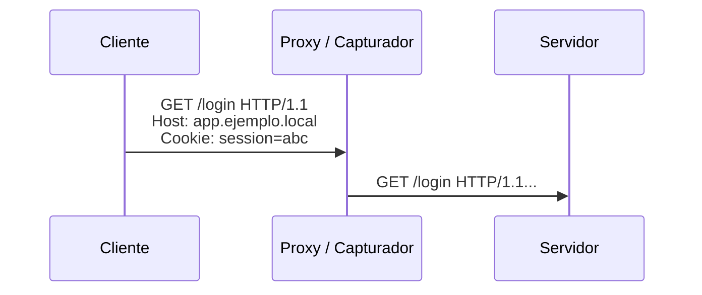
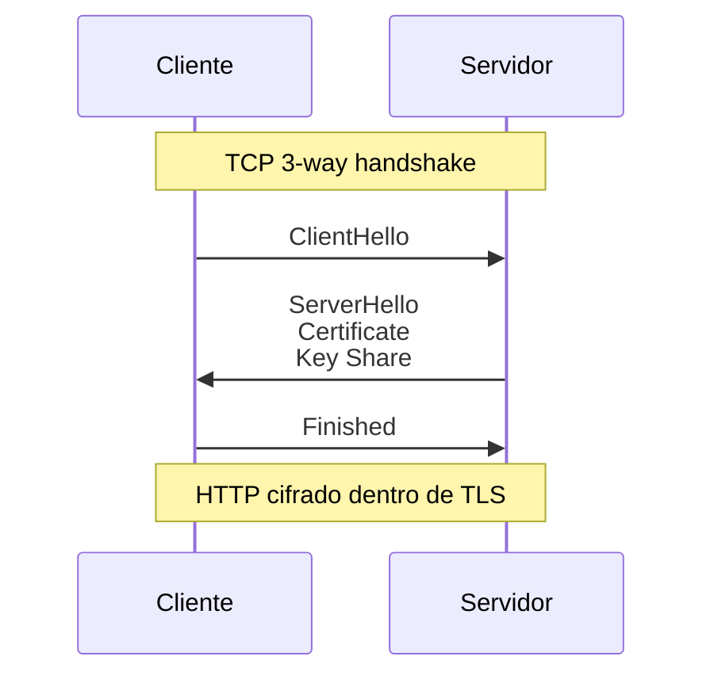

# HTTP vs HTTPS y TLS Handshake

> [!abstract] TL;DR
> - **HTTP** transporta requests y responses en texto claro sobre TCP, típicamente en `80/tcp`.
> - **HTTPS** es HTTP encapsulado dentro de **TLS**, usualmente en `443/tcp`.
> - El **TLS handshake** negocia versión, suites criptográficas, valida el certificado del servidor y deriva claves de sesión.
> - Si DNS resuelve mal, TCP no conecta o TLS no valida, la app "web no anda", pero la falla está en capas distintas.

## Concepto

HTTP define semántica de aplicación: métodos, headers, códigos de estado, caché, autenticación y contenido. No cifra ni autentica por sí mismo. Si alguien puede capturar el tráfico entre cliente y servidor, ve URLs, cookies, credenciales y payloads.

HTTPS no es "otro protocolo web" en sentido estricto: es **HTTP sobre TLS**. TLS agrega tres propiedades operativas críticas:

- **Confidencialidad**: terceros no leen el contenido.
- **Integridad**: terceros no alteran el tráfico sin ser detectados.
- **Autenticidad**: el cliente verifica que el certificado presentado corresponde al nombre esperado y a una CA confiable.

En la práctica, cuando decís "abrí una web segura", lo que realmente sucede es:

1. Resolución DNS del nombre.
2. Conexión TCP al puerto `443`.
3. Handshake TLS.
4. Recién ahí empieza el intercambio HTTP real.

## Cómo funciona

### HTTP sin cifrado

Con HTTP puro, el request viaja legible por cualquier equipo con visibilidad del camino:



Eso simplifica debugging, pero desde seguridad es inaceptable para credenciales, tokens o datos sensibles.

### HTTPS con TLS

En HTTPS, el contenido HTTP queda dentro de un túnel cifrado:



### Handshake TLS 1.3, resumido

En TLS 1.3 el flujo es más compacto que en 1.2:

1. **ClientHello**: el cliente propone versiones, cipher suites, extensiones y SNI.
2. **ServerHello**: el servidor elige parámetros compatibles.
3. **Certificate**: presenta su certificado X.509.
4. **CertificateVerify**: demuestra posesión de la clave privada.
5. **Finished**: ambas partes confirman que derivaron la misma clave de sesión.

El punto clave es que el cliente no "confía porque sí". Verifica:

- que el `CN` o `SAN` coincida con el hostname;
- que la cadena de certificación llegue a una CA confiable;
- que el certificado esté vigente;
- que no esté revocado, según política y soporte del cliente;
- que la negociación no haya caído a una versión insegura.

> [!tip] SNI y certificados virtuales
> En un mismo IP puede haber varios sitios HTTPS. El cliente envía el hostname en la extensión **SNI** para que el servidor presente el certificado correcto.

### Qué se cifra y qué no

Con HTTPS, el contenido HTTP queda cifrado, pero todavía hay metadatos visibles:

- IP origen y destino.
- Puerto.
- Timing, volumen y patrón de tráfico.
- En muchos casos, el nombre del sitio vía SNI si no se usa ECH.

## Comandos / configuración

```bash
# Ver headers HTTP/HTTPS y negociación básica
curl -I http://example.com
curl -I https://example.com

# Mostrar detalle TLS y certificado del servidor
openssl s_client -connect 203.0.113.10:443 -servername app.example.test

# Forzar una versión concreta para troubleshooting
openssl s_client -tls1_2 -connect 203.0.113.10:443 -servername app.example.test

# Descargar sin verificar CA (solo laboratorio)
curl -k https://203.0.113.10

# Ver respuesta completa y tiempos
curl -v https://app.example.test/login
```

Ejemplo mínimo de virtual host TLS en Nginx:

```nginx
server {
    listen 443 ssl http2;
    server_name app.example.test;

    ssl_certificate     /etc/ssl/certs/app.example.test/fullchain.pem;
    ssl_certificate_key /etc/ssl/private/app.example.test/privkey.pem;

    location / {
        proxy_pass http://127.0.0.1:8080;
    }
}
```

> [!warning] `curl -k` no "arregla" TLS
> Solo desactiva la validación del certificado del lado cliente. Sirve para aislar si el problema es PKI, pero en producción normaliza una mala práctica.

## Troubleshooting

| Síntoma | Causa probable | Comando de diagnóstico |
|---------|----------------|------------------------|
| `Connection refused` al `443` | No hay proceso escuchando o el servicio cayó antes de TLS. | `ss -tlnp \| grep :443` |
| Timeout a `443/tcp` | Firewall, routing o ACL intermedia. | `traceroute`, `mtr`, `tcpdump -n host 203.0.113.10 and port 443` |
| `certificate verify failed` | CA no confiable, CN/SAN incorrecto o fecha inválida. | `openssl s_client -connect 203.0.113.10:443 -servername app.example.test` |
| Redirige a HTTPS pero el sitio queda roto | Mixed content o backend generado con URLs `http://`. | `curl -vk https://app.example.test` y revisar HTML/headers |
| Error de hostname | Se conecta por IP pero el certificado fue emitido para FQDN. | Probar con `-servername` y usar el nombre correcto |

## Seguridad / ofensiva

HTTPS endurece el canal, pero no vuelve "segura" a una aplicación vulnerable.

### 1. MITM y certificados falsos

Si el atacante logra instalar una CA raíz confiable en el endpoint o controlar un proxy corporativo con inspección TLS, puede interceptar tráfico cifrado sin disparar alertas visibles para el usuario promedio.

> [!danger] Confianza del endpoint
> TLS protege contra el camino de red hostil. No protege si el endpoint ya confía en una CA maliciosa o comprometida.

### 2. Downgrade y versiones viejas

TLS 1.0/1.1, suites débiles o configuraciones legacy amplían superficie de ataque. En entornos reales todavía aparecen balanceadores viejos, appliances y middleboxes que fuerzan compatibilidad insegura.

### 3. Enumeración y fingerprinting

Desde Red Team, aún con contenido cifrado podés inferir bastante:

- certificados expuestos;
- nombres alternativos en `SAN`;
- versiones soportadas;
- ALPN (`http/1.1`, `h2`);
- headers vía respuestas controladas;
- comportamiento distinto según SNI.

```bash
nmap --script ssl-cert,ssl-enum-ciphers -p 443 203.0.113.10
```

### 4. HSTS y superficie residual

HSTS reduce ataques de downgrade HTTP->HTTPS, pero solo después de que el cliente ya vio la política o si el dominio está precargado en navegadores. El primer acceso sigue siendo un punto delicado si no hay preload.

## Relacionado

- [[tcp-estados-y-handshake]]
- [[dns-jerarquia-resolucion]]

## Referencias

- RFC 9110 - *HTTP Semantics*
- RFC 9112 - *HTTP/1.1*
- RFC 8446 - *The Transport Layer Security (TLS) Protocol Version 1.3*
- OpenSSL Documentation - `openssl-s_client`
- `man curl`
