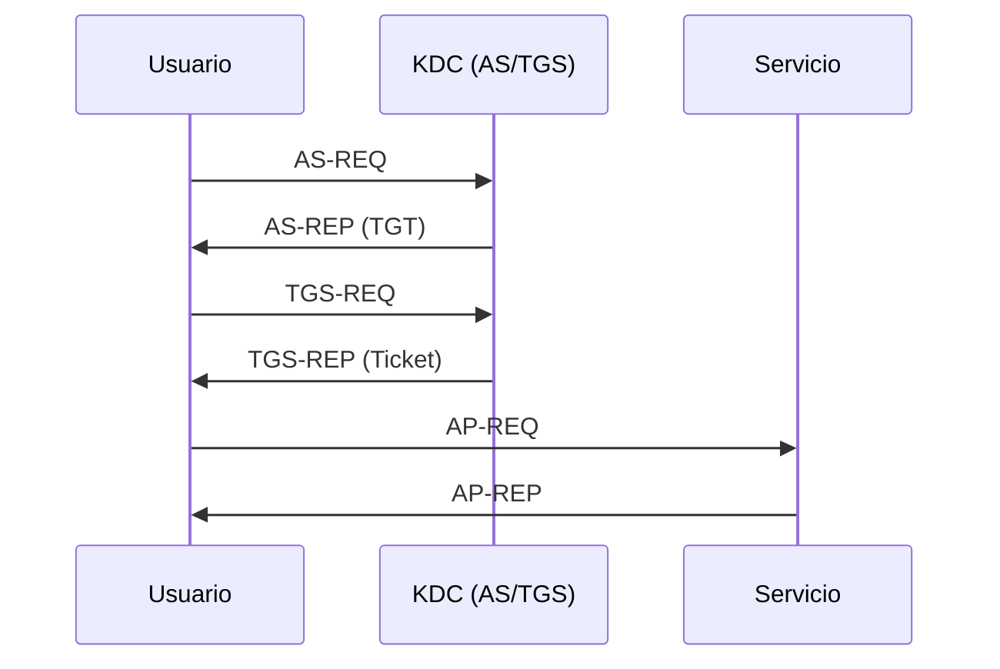

# Kerberos Basico

> [!abstract] TL;DR
> - **Kerberos** es un protocolo de autenticación basado en tickets y criptografía simétrica.
> - Evita mandar la contraseña del usuario por la red en cada acceso a servicio.
> - En Active Directory, el **Domain Controller** actúa como **KDC**: AS + TGS.
> - Tickets, SPNs y sincronización horaria son conceptos centrales para operación y seguridad.

## Concepto

Kerberos resuelve un problema clásico: cómo autenticar usuarios y servicios en red sin enviar la contraseña cada vez y minimizando la exposición a interceptación. La respuesta es usar un tercero confiable, el **KDC** (Key Distribution Center), que emite tickets temporales.

En AD, el KDC vive en el Domain Controller y cumple dos roles:

- **AS** (Authentication Service)
- **TGS** (Ticket Granting Service)

En vez de decir "mi password es X" a cada servidor, el usuario obtiene tickets y se los presenta al servicio correspondiente.

## Cómo funciona

### Componentes

- **Principal**: identidad Kerberos, por ejemplo `usuario@EXAMPLE.LOCAL`.
- **TGT**: Ticket Granting Ticket; permite pedir otros tickets.
- **TGS / Service Ticket**: ticket específico para un servicio.
- **SPN**: nombre del servicio asociado a una cuenta, por ejemplo `cifs/filesrv01.example.local`.

### Flujo simplificado



Lectura operativa:

1. El usuario demuestra identidad al AS y obtiene un **TGT**.
2. Con ese TGT pide al TGS un ticket para un servicio concreto.
3. Presenta ese ticket al servicio.
4. El servicio valida con su propia clave y acepta la sesión.

### Por qué importa la hora

Kerberos usa timestamps y ventanas de validez cortas. Si el reloj del cliente se desvía demasiado respecto al KDC, la autenticación falla aunque la password sea correcta.

> [!warning] Desfase horario
> Si ves errores raros de autenticación en dominio, siempre chequeá tiempo y NTP antes de culpar a credenciales o red.

### SPNs

Los **Service Principal Names** atan servicios a cuentas. Si un SPN está mal registrado:

- el cliente pide ticket para una identidad incorrecta;
- el servicio no puede descifrarlo;
- aparecen fallas aparentemente "misteriosas".

## Comandos / configuración

Linux / MIT Kerberos:

```bash
# Ver tickets actuales
klist

# Obtener TGT manualmente
kinit usuario@EXAMPLE.LOCAL

# Destruir tickets en caché
kdestroy

# Ver parámetros del realm
cat /etc/krb5.conf
```

Windows:

```powershell
# Ver tickets del usuario actual
klist

# Purgar tickets
klist purge

# Ver configuración de dominio y DC
nltest /dsgetdc:example.local
```

Ejemplo mínimo de configuración MIT Kerberos:

```ini
[libdefaults]
    default_realm = EXAMPLE.LOCAL
    dns_lookup_kdc = true
    rdns = false

[realms]
    EXAMPLE.LOCAL = {
        kdc = dc01.example.local
    }
```

## Troubleshooting

| Síntoma | Causa probable | Comando de diagnóstico |
|---------|----------------|------------------------|
| `Clock skew too great` | Desfase de tiempo entre cliente y KDC. | `timedatectl`, NTP, `w32tm /query /status` |
| Pide password repetidamente en vez de SSO | No obtiene TGT o cae a NTLM. | `klist`, logs de autenticación |
| Servicio accesible por IP pero no por nombre | Kerberos depende de SPN/FQDN; por IP suele romperse. | Probar con FQDN y revisar SPN |
| `KDC unreachable` | DNS, firewall o KDC caído. | Resolver DC, probar `88/tcp` y `88/udp` |
| Acceso a SMB/HTTP falla solo en dominio | SPN mal registrado o duplicado. | Herramientas AD de SPN y logs del DC |

## Seguridad / ofensiva

### 1. Valor ofensivo de Kerberos

Para Red Team, Kerberos es una fuente enorme de material reusable:

- tickets en memoria;
- hashes asociados a cuentas de servicio;
- delegaciones;
- SPNs expuestos;
- posibilidad de impersonación en malas configuraciones.

### 2. Ataques conocidos

Sin entrar en detalle excesivo, las familias más relevantes son:

- **Kerberoasting**: pedir tickets de servicio y crackear offline material asociado.
- **AS-REP roasting**: abusar cuentas sin preauth.
- **Pass-the-Ticket**: reutilización de tickets robados.
- abuso de **delegation** y relaciones de confianza.

> [!danger] Kerberos no elimina riesgo de credenciales
> Reduce exposición de contraseñas en tránsito, pero si el endpoint está comprometido, tickets y secretos derivados siguen siendo material útil para movimiento lateral.

### 3. Controles defensivos

- NTP consistente;
- cuentas de servicio robustas y rotadas;
- deshabilitar configuraciones débiles;
- monitoreo de solicitudes anómalas de TGS;
- revisión de SPNs y delegaciones.

## Relacionado

- [[ldap-y-active-directory]]
- [[smb-cifs-y-shares-windows]]

## Referencias

- RFC 4120 - *The Kerberos Network Authentication Service (V5)*
- MIT Kerberos Documentation
- Microsoft Learn - *Kerberos authentication overview*
- `man kinit`
- `man klist`
