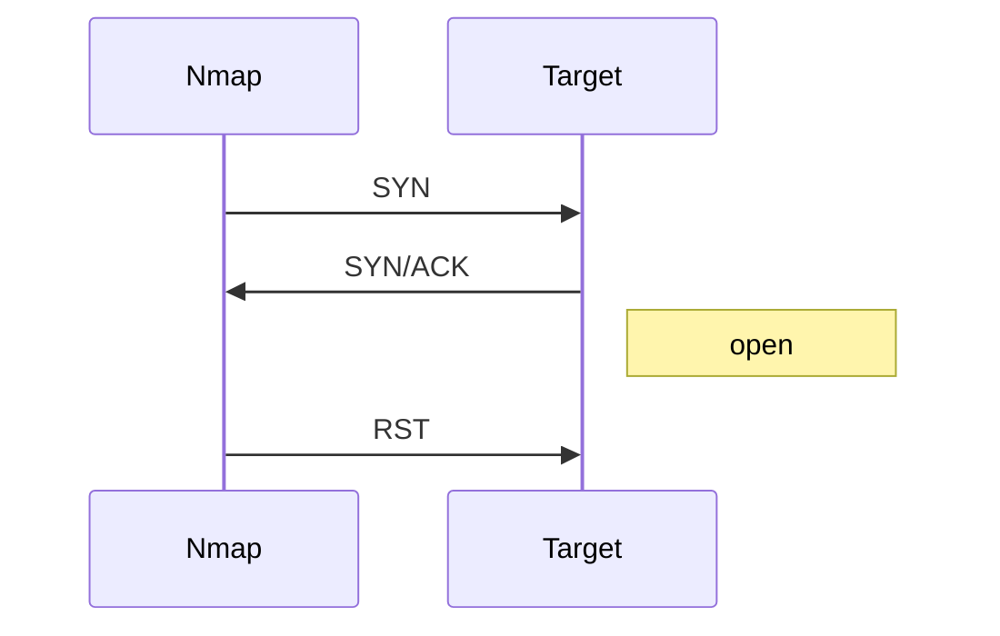

# Nmap Tecnicas de Scan

> [!abstract] TL;DR
> - Nmap no "hace magia": interpreta respuestas TCP, UDP e ICMP para inferir estados.
> - Los scans más comunes son `-sS`, `-sT`, `-sU`, descubrimiento con `-sn` y detección de servicios con `-sV`.
> - El significado de `open`, `closed`, `filtered` y `open|filtered` depende del protocolo y la respuesta recibida.
> - Escanear bien es elegir técnica, ritmo y alcance según objetivo, red y nivel de ruido aceptable.

## Concepto

Nmap es una herramienta de enumeración de red, no solo de puertos. Permite descubrir hosts, mapear servicios, estimar sistemas operativos y ejecutar scripts NSE. Pero su base sigue siendo inferencial: manda paquetes diseñados y observa cómo responde la pila remota.

La pregunta real no es "qué comando uso", sino:

- ¿estoy en la misma red o detrás de varios saltos?
- ¿necesito velocidad o bajo perfil?
- ¿me importa exactitud o cobertura inicial?
- ¿hay firewalls stateful, rate limits o IDS?

## Cómo funciona

### Estados de puertos

Nmap suele clasificar así:

- **open**: el servicio respondió como abierto.
- **closed**: el host respondió, pero no hay servicio.
- **filtered**: algún filtro bloqueó la inferencia.
- **open|filtered**: no pudo distinguir entre abierto y filtrado.

### Técnicas comunes

#### SYN scan (`-sS`)

Envía SYN y observa:

- SYN/ACK => `open`
- RST => `closed`
- silencio / ICMP => `filtered`



Es rápido y relativamente discreto porque no completa la conexión.

#### Connect scan (`-sT`)

Usa la API del sistema operativo para completar una conexión TCP real. Es menos sigiloso, pero útil cuando no tenés privilegios para raw sockets.

#### UDP scan (`-sU`)

Mucho más incierto:

- ICMP port unreachable => `closed`
- respuesta UDP válida => `open`
- silencio => `open|filtered`

#### Ping scan / host discovery (`-sn`)

Descubre hosts activos sin port scan completo. Según contexto usa ICMP, ARP, TCP o combinaciones.

### Detección de servicios y versiones

Después del puerto abierto, Nmap puede hablar con el servicio:

```bash
nmap -sV -p 22,80,443 192.168.56.20
```

Eso ayuda a distinguir "puerto 443 abierto" de "es Nginx", "es Apache" o "es un appliance raro".

## Comandos / configuración

```bash
# Descubrir hosts activos
nmap -sn 192.168.56.0/24

# SYN scan rápido
sudo nmap -sS -Pn -p 22,80,443 192.168.56.20

# Connect scan
nmap -sT -Pn -p 22,80,443 192.168.56.20

# UDP top ports
sudo nmap -sU --top-ports 20 192.168.56.20

# Detección de versiones
nmap -sV -Pn 192.168.56.20

# Fingerprinting de SO
sudo nmap -O 192.168.56.20

# Scripts NSE útiles
nmap --script default -p 80,443 192.168.56.20

# Menos ruido, más control
nmap -sS -T2 --max-retries 2 -Pn 192.168.56.20
```

> [!tip] `-Pn`
> Si un host bloquea ICMP o respuestas de descubrimiento, `-Pn` evita que Nmap lo descarte prematuramente como "caído".

## Troubleshooting

| Síntoma | Causa probable | Comando de diagnóstico |
|---------|----------------|------------------------|
| Todo sale `filtered` | Firewall o ACL intermedia. | Correlacionar con `tcpdump` o `traceroute` |
| Un puerto parece abierto pero la app no responde | Servicio real detrás de proxy, WAF o backend roto. | `nmap -sV` y luego prueba manual con `curl`/`nc` |
| UDP tarda muchísimo | Silencio ambiguo y retries altos. | Reducir a `--top-ports` o puertos concretos |
| El scan da distinto desde dos orígenes | Segmentación, ACLs o respuestas contextuales. | Comparar desde cada segmento |
| `-sS` no funciona | Falta privilegio para raw sockets. | Caer a `-sT` |

## Seguridad / ofensiva

### 1. Ruido y detección

Nmap bien usado es quirúrgico; mal usado es una sirena. Un `/16` con `-T5 -A` contra una red corporativa no es reconocimiento, es autopista a detección.

### 2. Estrategia ofensiva razonable

Secuencia típica:

1. descubrimiento acotado;
2. puertos críticos;
3. detección de versiones;
4. scripts específicos;
5. validación manual.

### 3. Señales para Blue Team

- ráfagas de SYN a múltiples puertos;
- secuencias UDP raras;
- banners tocados por probes atípicos;
- NSE contra servicios comunes.

> [!warning] El estado no es la explotación
> Ver `445/tcp open` no implica vulnerabilidad. Solo indica reachability y un servicio escuchando. La siguiente pregunta siempre es versión, configuración y controles.

## Relacionado

- [[tcp-estados-y-handshake]]
- [[udp-vs-tcp-cuando-cual]]

## Referencias

- Nmap Reference Guide
- Nmap Book - *Network Scanning*
- `man nmap`
