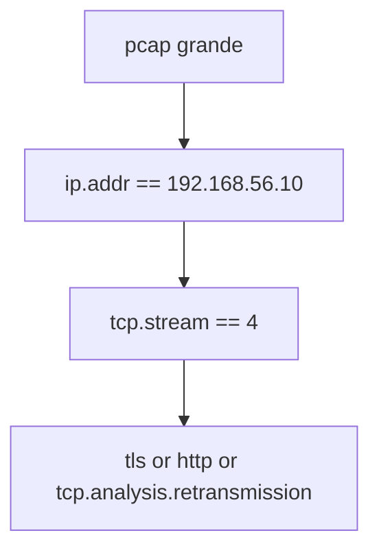

# Wireshark Display Filters

> [!abstract] TL;DR
> - Los **display filters** de Wireshark filtran paquetes ya capturados o ya visibles en memoria.
> - No son lo mismo que los **capture filters** BPF.
> - Son más expresivos para análisis fino: campos de protocolo, flags, valores concretos y combinaciones complejas.
> - Saber filtrar bien es la diferencia entre "ver paquetes" y entender una conversación.

## Concepto

Wireshark decodifica protocolos y expone campos de alto nivel: `ip.addr`, `tcp.flags.syn`, `http.request.method`, `dns.qry.name`, `tls.handshake.type`, etc. Los display filters operan sobre esos campos ya interpretados.

Eso los vuelve ideales para:

- aislar una conversación puntual;
- seguir errores de aplicación;
- correlacionar handshake TCP/TLS/HTTP;
- inspeccionar respuestas anómalas;
- preparar evidencia técnica más legible.

## Cómo funciona

### Display filter vs capture filter

La distinción importante:

- **Capture filter**: descarta en origen usando BPF, antes de guardar/ver.
- **Display filter**: no cambia la captura original; solo cambia qué muestra Wireshark.

Si capturaste demasiado, el display filter te salva el análisis. Si capturaste mal, ya llegaste tarde.

### Sintaxis básica

Ejemplos comunes:

```text
ip.addr == 192.168.56.10
tcp.port == 443
dns
http.request
tls.handshake.type == 1
```

Podés combinar con:

- `and`
- `or`
- `not`
- `contains`
- `matches`

### Flujo típico de análisis



Ese refinamiento gradual es mucho más efectivo que intentar escribir un mega filtro perfecto desde el principio.

> [!tip] `tcp.stream`
> Cuando encontraste el flujo correcto, `tcp.stream == N` suele ser la forma más limpia de aislar la conversación completa.

## Comandos / configuración

Filtros útiles de display:

```text
# IPs y puertos
ip.addr == 192.168.56.10
ip.src == 192.168.56.10 and tcp.dstport == 443

# TCP
tcp
tcp.flags.syn == 1 and tcp.flags.ack == 0
tcp.analysis.retransmission
tcp.analysis.zero_window

# DNS
dns
dns.response.code != 0
dns.qry.name contains "example"

# HTTP
http.request
http.response.code == 500
http.host == "app.example.test"

# TLS
tls
tls.handshake.type == 1
tls.handshake.extensions_server_name == "app.example.test"

# SMB y Kerberos
smb2
kerberos
ldap
```

Uso práctico con Tshark:

```bash
# Aplicar display filter desde CLI
tshark -r captura.pcapng -Y "ip.addr == 192.168.56.10 and tcp.port == 443"

# Mostrar campos concretos
tshark -r captura.pcapng -Y "dns" -T fields -e frame.number -e ip.src -e dns.qry.name
```

## Troubleshooting

| Síntoma | Causa probable | Comando de diagnóstico |
|---------|----------------|------------------------|
| No aparece tráfico esperado | Estás usando display filter cuando el problema es de captura. | Revisar si el paquete existe sin filtro |
| El filtro da cero resultados | Campo incorrecto, typo o protocolo mal decodificado. | Validar el nombre del campo desde Wireshark |
| Ves TCP pero no HTTP | Puede ser TLS, puerto no estándar o falta de reassembly. | Probar `tls`, `tcp.stream`, Follow Stream |
| Demasiado ruido aún con filtro | El filtro es amplio; falta reducir por stream, host o método. | `tcp.stream == N` o `ip.addr == X` |
| La app falla pero no se ve error claro | El problema es anterior: DNS/TCP/TLS, no HTTP. | Filtrar por capa y avanzar paso a paso |

## Seguridad / ofensiva

### 1. Análisis de tráfico cifrado

Aunque no tengas claves TLS, Wireshark permite analizar:

- handshake;
- SNI;
- suites;
- certificados;
- timing;
- resets y retransmisiones.

### 2. Hunting y DFIR

Filtros muy útiles para hunting:

```text
dns.qry.name contains "update"
http.user_agent contains "curl"
tcp.flags.reset == 1
kerberos or ldap or smb2
```

### 3. Riesgo operativo

Abrir capturas sin criterio puede llevarte a conclusiones equivocadas: el paquete está, sí, pero quizá lo generó el sistema, una retransmisión o un middlebox.

> [!note] Paquete visto no implica éxito
> Ver un request en pantalla solo prueba que apareció en ese punto de captura. No prueba que el otro extremo lo haya procesado correctamente.

## Relacionado

- [[tcpdump-cheatsheet-y-bpf]]
- [[http-vs-https-tls-handshake]]

## Referencias

- Wireshark Documentation - *Display Filter Reference*
- Wireshark Documentation - *User's Guide*
- `man tshark`
